# TOPIC 2: BASIC PROBABILITY & STATISTICS

### Initialise working directory and read file

```r
setwd("/Users/yizhong/School/Y2S1/DSA1101/Data")
sales <- read.csv("yearly_sales.csv")
```

### View sample data

```r
head(sales)
```

| cust_id | sales_total | num_of_orders | gender |
| ------- | ----------- | ------------- | ------ |
| 100001  | 800.64      | 3             | F      |
| 100002  | 217.53      | 3             | F      |
| 100003  | 74.58       | 2             | M      |
| 100004  | 498.60      | 3             | M      |
| 100005  | 723.11      | 4             | F      |
| 100006  | 69.43       | 2             | F      |

Round all sales value to 2 decimal places and store it in a `total` vector:

```r
total = round(sales$sales_total, digits = 2)
```

Total number of sales:

```r
n = length(total); n
```

```
[1] 10000
```

## Single Categorical Variable

### Frequency Table

For a single categorical variable, we can use frequency table (which also can produce the proportion or percentage) as numerical summaries.

The category with the highest frequency is reported as the **modal category**.

```r
count = table(sales$gender); count
```

```
   F    M
5035 4965
```

### Barplot

```r
barplot(count)
```

<div align="center">
  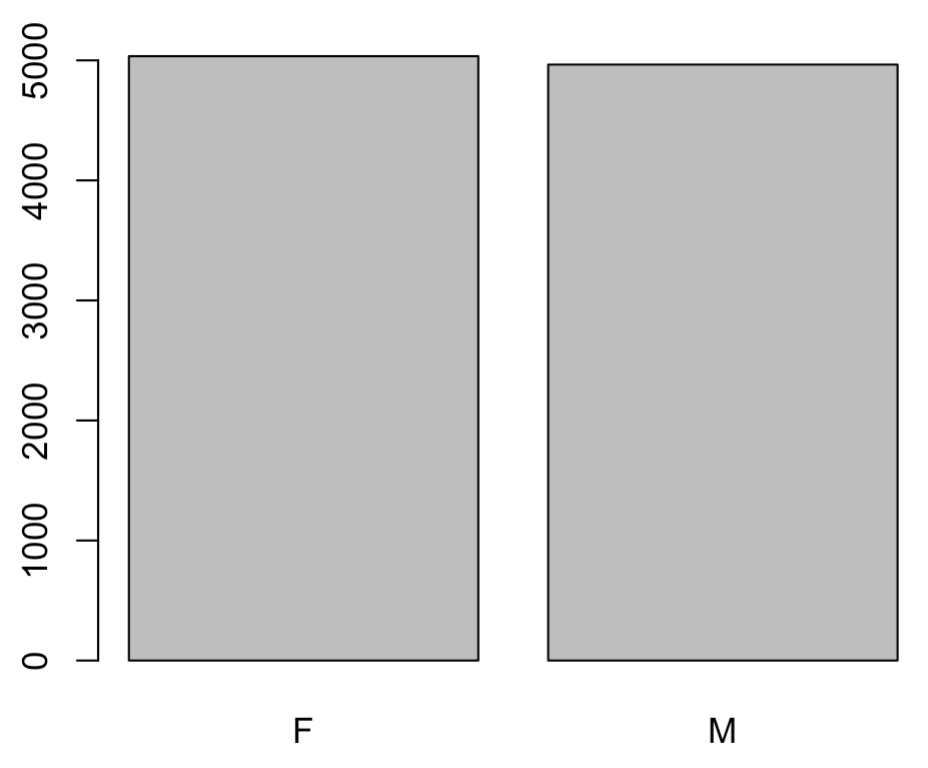
</div>

### Pie Chart

```r
pie(count)
```

<div align="center">
  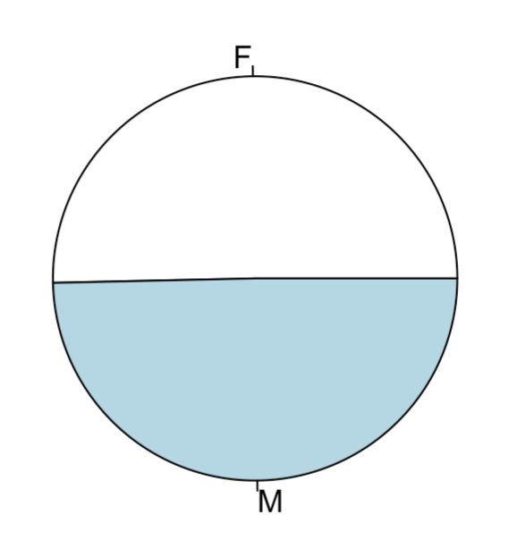
</div>

---

## Single Quantitative Variable

### Numerical Summaries

Five-number summary:

```r
summary(total)
```

```
 Min. 1st Qu.  Median    Mean 3rd Qu.    Max.
30.02   80.29  151.65  249.46  295.50 7606.09
```

- For a sample, if the mean is the same or approximately the same as the median, then the sample is close to symmetric.
- Mean is sensitive to the outlier(s) while median is not.
- When the mean is much larger than the median, sample is right skewed; while when the mean is much smaller than the median then sample is left skewed.

Other useful information on variability:

```r
range(total) # [1] 30.02 7606.09

var(total) # [1] 101793.4

sd(total) # [1] 319.0508

IQR(total) # [1] 215.21

total[order(total)[1:5]] # The 5 smallest observations
total[order(total)[(n-4):n]] #The 5 largest observations
```

However, numerical summaries are **not enough**. All 3 samples below have a sample mean of 0 and sample variance of 1.

<div align="center">
  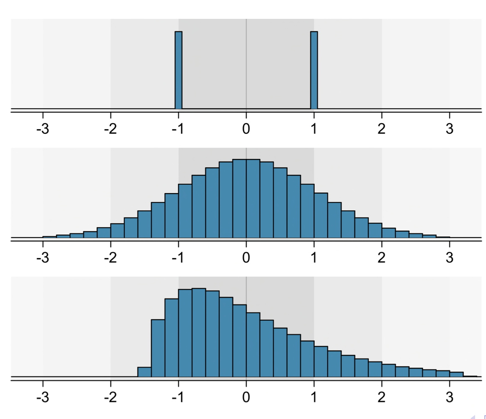
</div>

### Histograms and Density Plots

A histogram is a graph that uses bars to portray the frequencies or relative frequencies of the possible outcomes for a quantitative variable.

Density plots can be thought of as plots of smoothed histograms.

#### Unimodal histogram with suspected outliers on the right

<div align="center">
  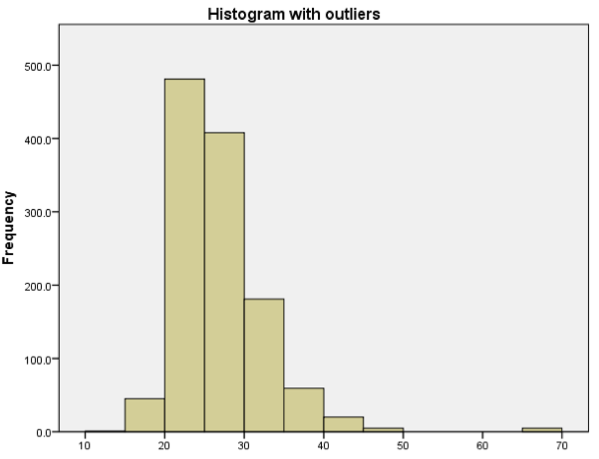
</div>

---

#### Unimodal and Bimodal Histograms

<div align="center">
  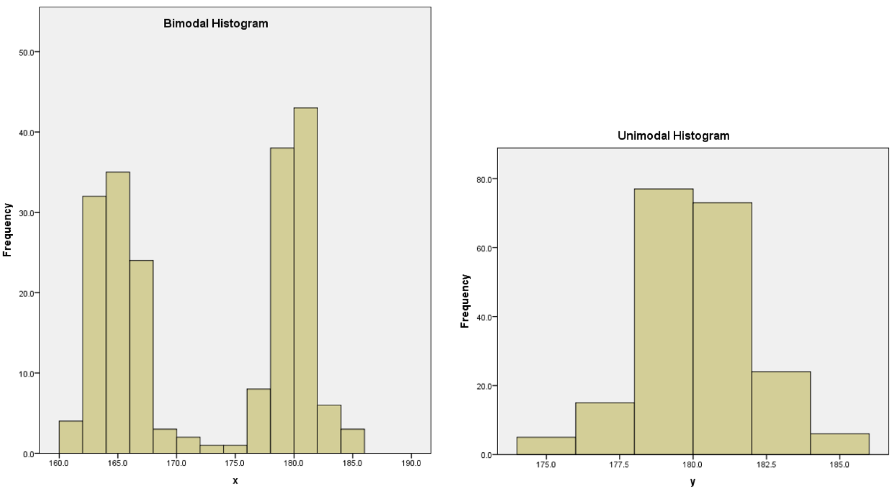
</div>

---

#### Histograms with Different Skewness

<div align="center">
  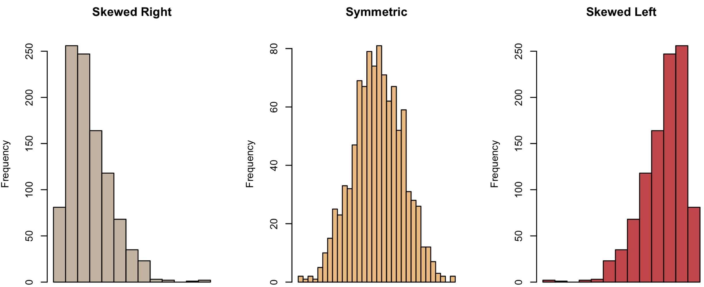
</div>

---

### Plotting Histograms

Normal histogram:

```r
hist(total, freq=TRUE, main = paste("Histogram of Total Sales"),
     xlab = "total", ylab="Frequency", col = "blue")
```

<div align="center">
  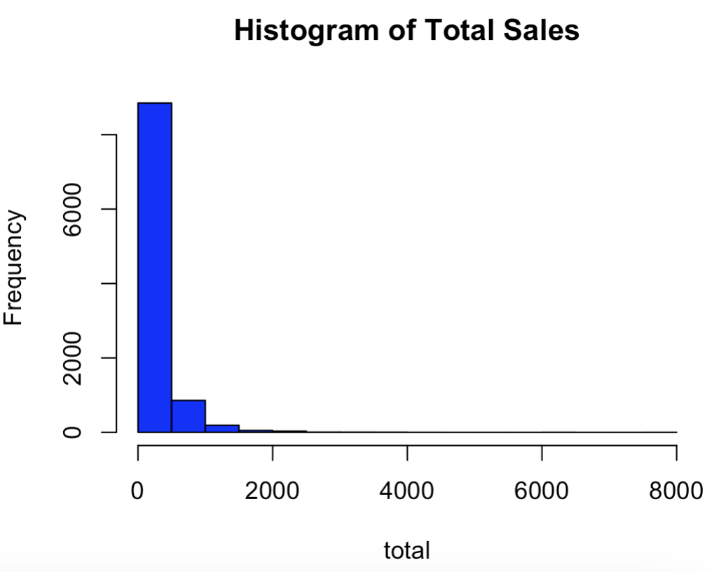
</div>

---

Histogram with density curve (`ylim` argument to scale the y-axis, otherwise the density line exceeds the graph):

```r
hist(total, freq=FALSE, main = paste("Histogram of total sales"),
     xlab = "total", ylab="Probability",
     col = "blue", ylim = c(0, 0.005))
lines(density(total), col = "red") # this is the density curve of "total"
```

<div align="center">
  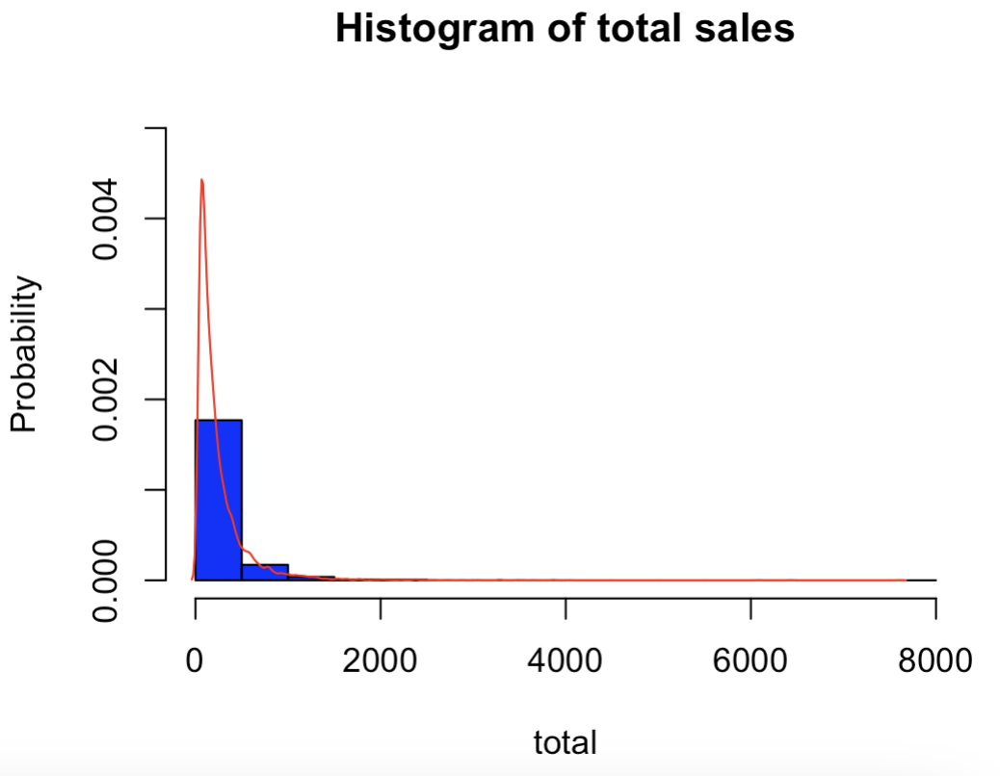
</div>

---

Histogram with **normal** density curve (assumes data is normally distributed):

```r
hist(total, freq=FALSE, main = paste("Histogram of Total Sales"),
     xlab = "total sales", ylab="Probability",
     col = "grey", ylim = c(0, 0.002))

# Creates a sequence of n evenly spaced values from 0 to the maximum value in total.
x <- seq(0, max(total), length.out=n)

#Computes the normal density values for the sequence x using the mean and standard deviation of total.
y <- dnorm(x, mean(total), sd(total))

lines(x, y, col = "red") # this is the normal density curve
```

<div align="center">
  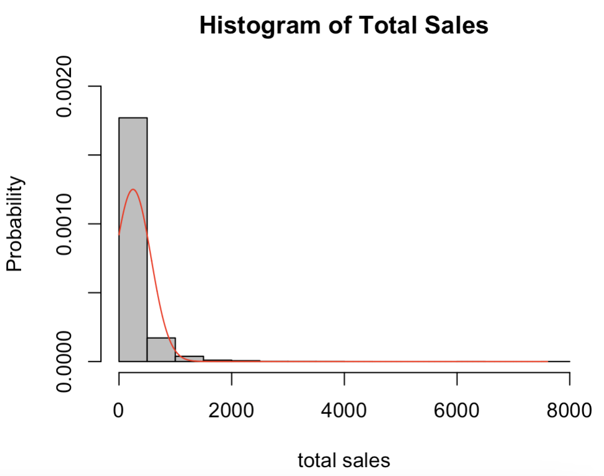
</div>

### Boxplots

Boxplots provide a skeletal representation of a distribution, and they are very well suited for showing distributions for multiple variables.

<div align="center">
  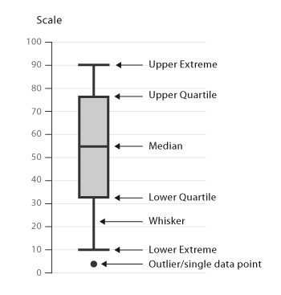
</div>

1. **Box**:

   - The box itself represents the interquartile range (IQR), which is the range between the first quartile ($Q1$) and the third quartile ($Q3$).

   $$\text{IQR} = Q3 - Q1$$

   - This range contains the middle 50% of the data.

2. **Median ($Q2$)**:

   - The line inside the box represents the median ($Q2$), which is the middle value of the dataset.
   - It splits the data into two equal halves.

3. **Whiskers**:

   - The whiskers extend from the box to the minimum and maximum values of the data, but only up to a certain point.
   - By default, the whiskers extend to $1.5 \times \text{IQR}$ from $Q1$ and $Q3$.
   - The lower whisker goes down to $Q1 - 1.5 \times \text{IQR}$.
   - The upper whisker goes up to $Q3 + 1.5 \times \text{IQR}$.
   - Data points beyond the whiskers are considered outliers.

4. **Outliers**:
   - Outliers are individual data points that fall outside of the range defined by the whiskers (i.e., beyond $1.5 \times \text{IQR}$).
   - They are plotted as individual points outside the whiskers.

### Plotting Boxplots

```r
boxplot(total, xlab = "Total Sales", col = "blue")
```

<div align="center">
  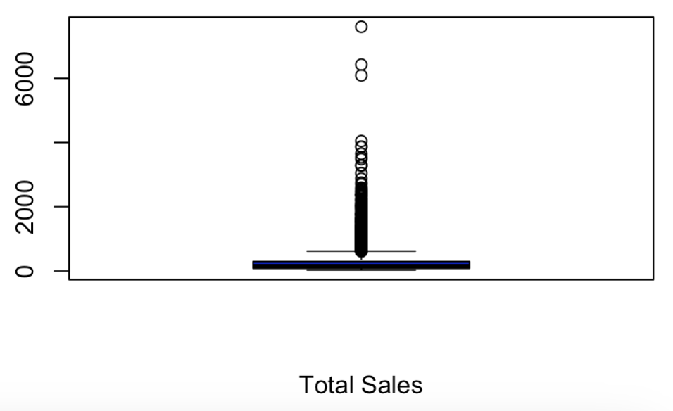
</div>

Outlier data:

```r
outlier = boxplot(total)$out # a vector of all outlier values
length(outlier) # 772 points that are outliers
index = which(total %in% outlier) # a vector of all outlier indices
```

Observations:

- Median is very low, close to 200.
- Box plot shows many outliers and extreme outliers.
- If sample is unimodal, then the distribution is highly right skewed.

### QQ plot

The purpose of plotting a QQ plot of a sample is to see if the sample follows (approximately) a normal distribution or not.

Figure on **left** is data with **both longer tails than normal**; figure on **right** is data with **both shorter tails than normal**:

<div align="center">
  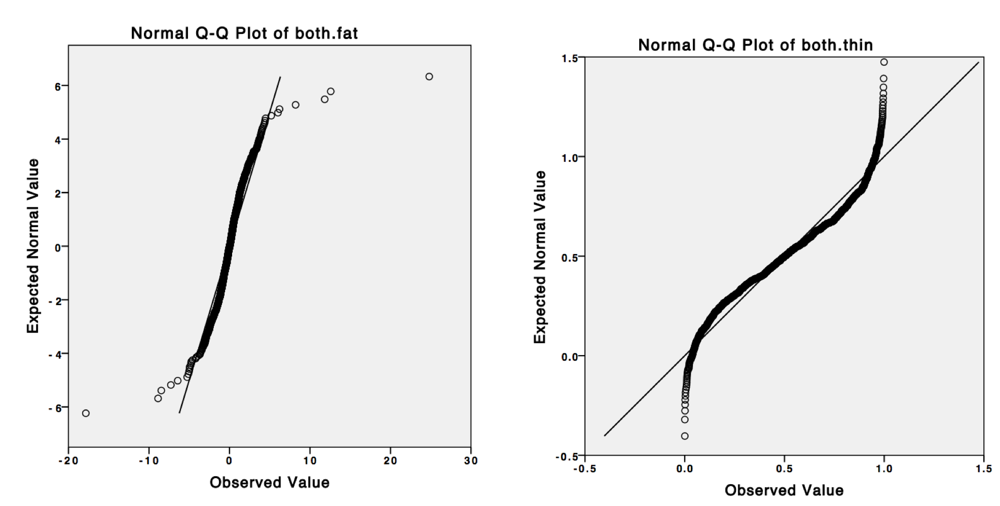
</div>

---

Figure on the **left** is a data with **left tail longer than normal** but **right tail is shorter than normal**; figure on the **right** is a **data with both tails are normal**:

<div align="center">
  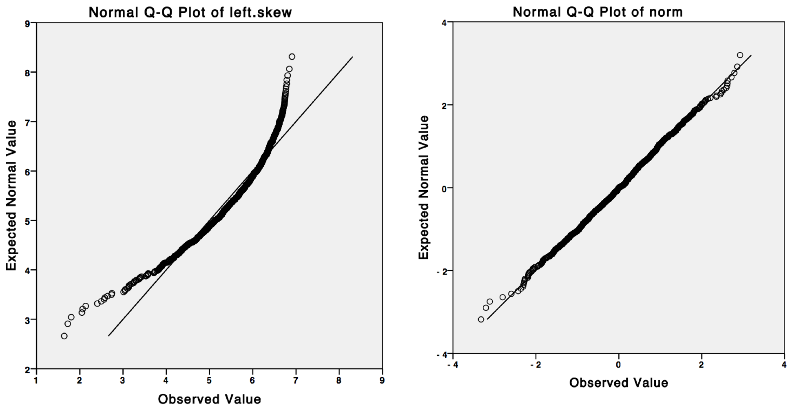
</div>

### Plotting QQ Plots

```r
qqnorm(total, main = "QQ Plot", pch = 20) # QQ plot of total
qqline(total, col = "red") # reference line for given the QQ plot.
```

<div align="center">
  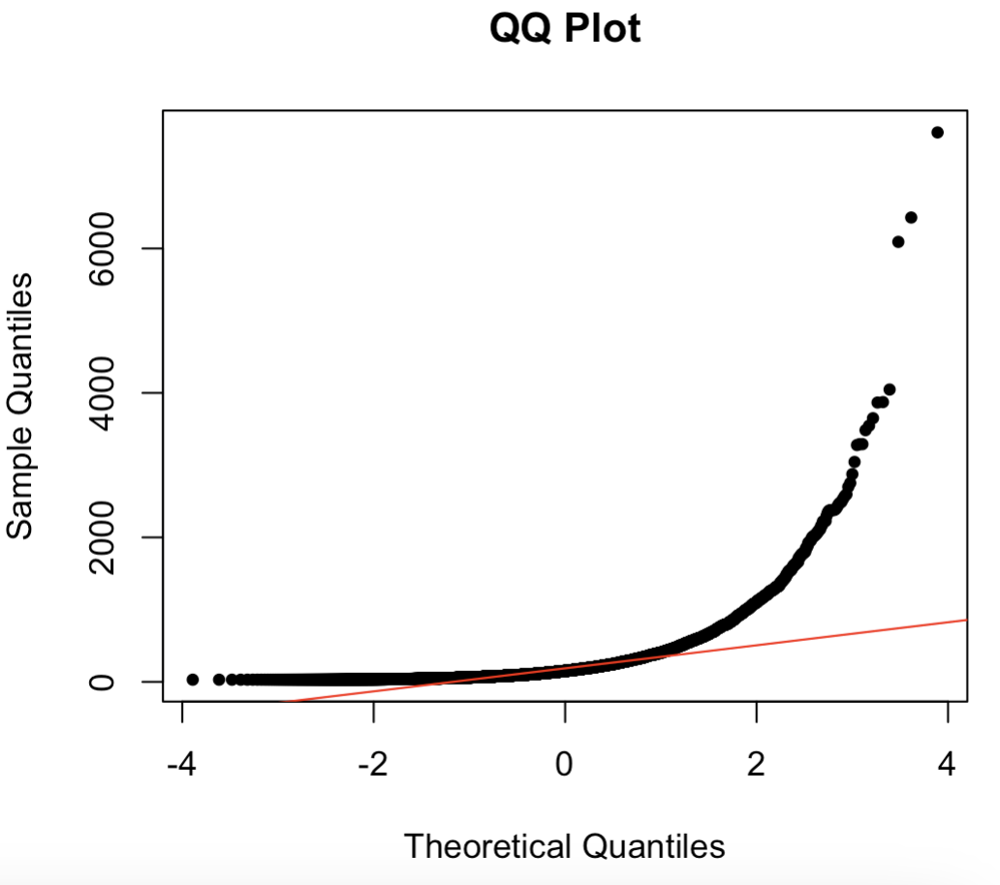
</div>

---

## Association Between Two Quantitative Variables

### Correlation Value

Let $X$ and $Y$ be two features from a set of $n$ points.

The correlation of these two is defined as:

$$
r = \frac{1}{n-1} \sum_{i=1}^{n} \left( \frac{X_i - \bar{X}}{s_X} \right) \left( \frac{Y_i - \bar{Y}}{s_Y} \right)
$$

where $\bar{X}, \bar{Y}$ are the sample means, $s_X, s_Y$ are the sample standard deviations of the two features.

Note that $r$ is always between -1 and 1. A positive value for r indicates a positive association and a negative value of r indicates a negative association.

Finding the correlation coefficient in R:

```r
order = sales$num_of_orders
cor(total, order) # 0.75
```

### Scatter Plot

Scatterplot can help to visualize the association between two quantitative features well.

What to say given a scatter plot:

- Is there any (possible) relationship between the 2 variables?
- If yes, is the association positive or negative?
- If there is association, is it linear or non-linear type?
- Are some observations unusual, departing from the overall trend?

### Plotting Scatter Plots

```r
plot(order, total, pch = 20, col = "darkblue")
```

<div align="center">
  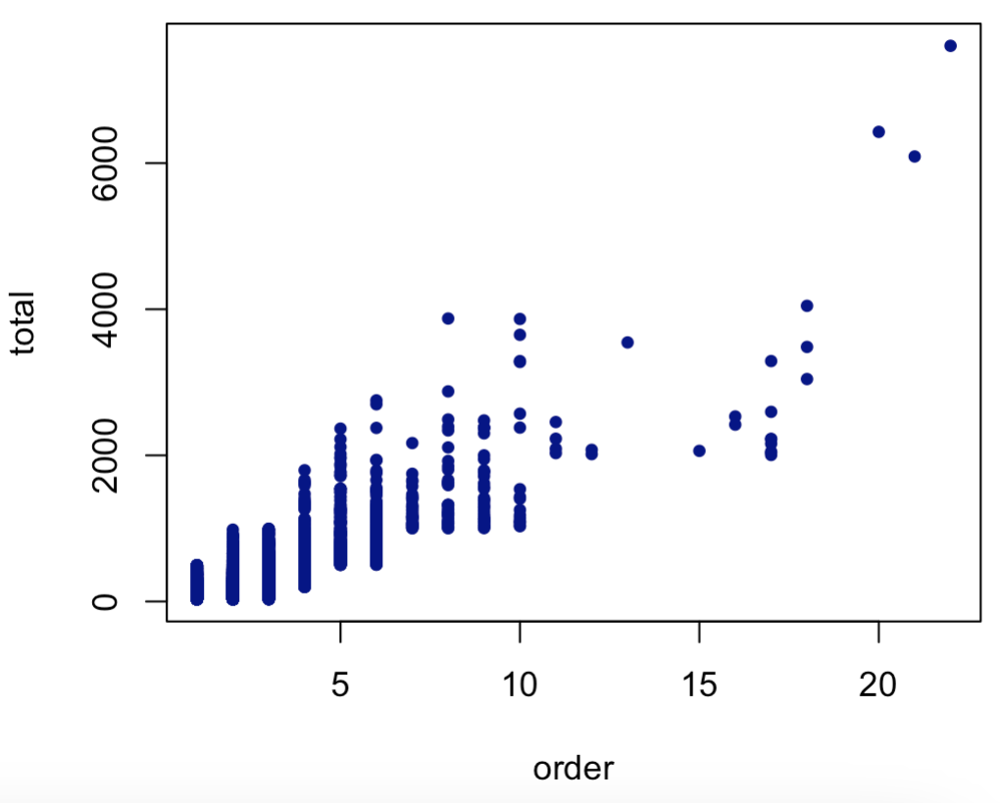
</div>

## Association Between One Categorical and One Quantitative Variable

### Boxplots of Multiple Groups

Categorical variable "cancer" has two categories: male and female. Variable "Age" is quantitative. One would check for any relationship between these two variables using a boxplot:

<div align="center">
  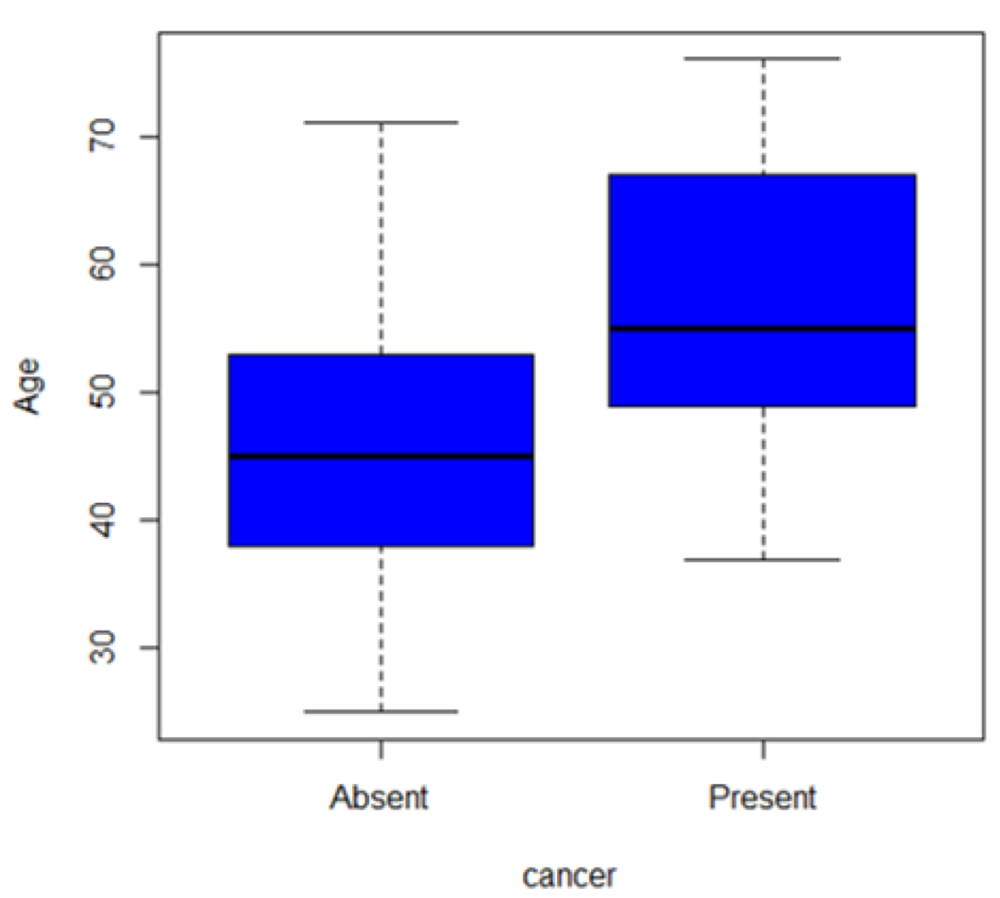
</div>

### Plotting Boxplots of Multiple Groups

```r
boxplot(total ~ sales$gender, col = "blue")
```

<div align="center">
  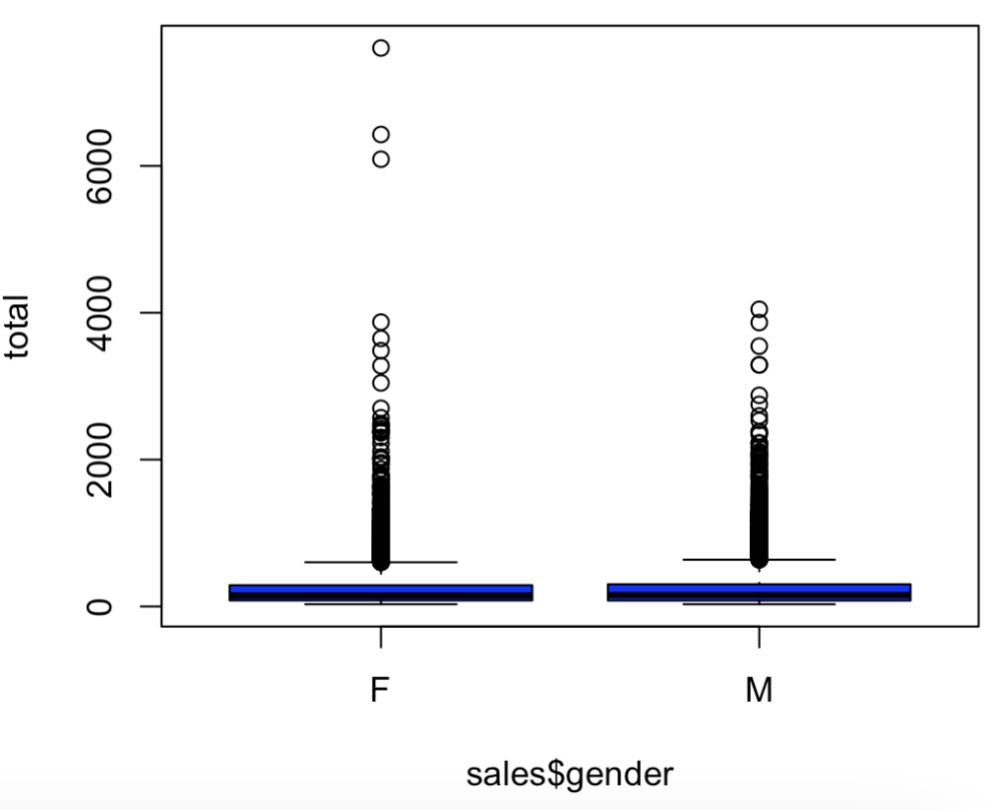
</div>

**Comments**: There is no obvious difference in the total sales of the customer's gender. The median of two groups are similar, and the IRQ are about the same.

# Association Between Three Quantitative Variables

Example: total sales, number of orders and the gender of the customers.

```r
order = sales$num_of_orders

attach(sales)

plot(order,total, type = "n") # a scatter plot with no point added
points(order[gender=="M"],total[gender=="M"],pch = 2, col = "blue") # MALE
points(order[gender=="F"],total[gender=="F"],pch = 20, col = "red") # FEMALE
legend(1,7500,legend=c("Female", "Male"),col=c("red", "blue"), pch=c(20,2))

# (x = 1, y =7500) tells R the place where you want to put the legend box in the plot
```

<div align="center">
  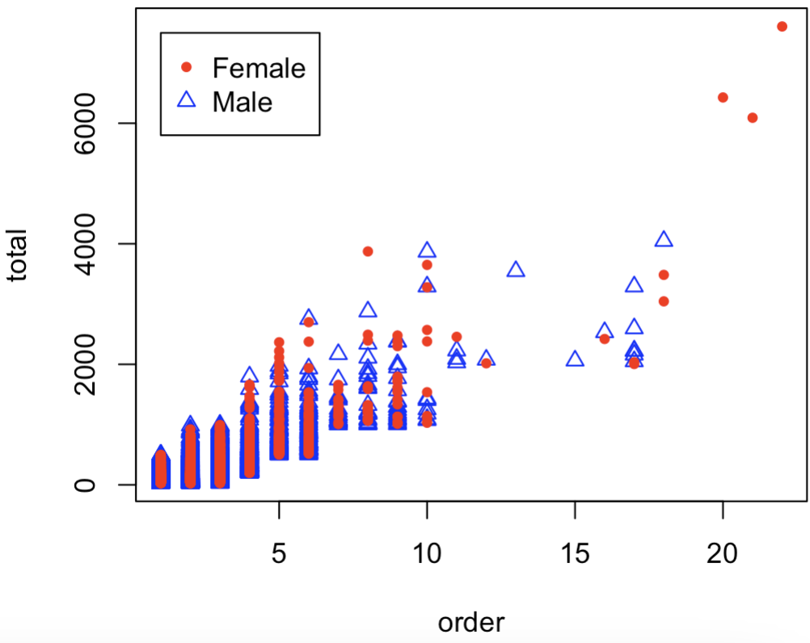
</div>

Note: Size of the points cannot be too big since the points added latter will overlay on the points added earlier. Hence, the points added latter should be chosen with smaller size so that they will not cover the points earlier.

## Association Between Two Categorical Variables

### Categorizing

Categorizing in general:

```r
numbers <- c(1, 2, 3, 4, 5)
result <- ifelse(numbers %% 2 == 0, "Even", "Odd")
```

```
[1] "Odd" "Even" "Odd" "Even" "Odd"
```

Categorizing "orders":

```r
order = sales$num_of_orders
order.size = ifelse(order<=5, "small", "large")
table(order.size)
```

```
large small
  324  9676
```

### Contingency Tables

```r
table = table(sales$gender,order.size);table
# 1st argument for independent variable, 2nd for response
```

```
  large small
F   142  4893
M   182  4783
```

### Contingency Tables of Joint Proportion

Proportion across whole table:

```r
prop.table(table)
```

```
   large  small
F 0.0142 0.4893
M 0.0182 0.4783
```

Proportion across rows:

```r
prop.table(table, "gender") # proportion by gender (does not really work)
prop.table(table, margin = 1)
```

```
       large      small
F 0.02820258 0.97179742
M 0.03665660 0.96334340
```

- Among orders by females, 2.82% are large orders while 3.67% of orders by males are large.

Proportion across columns:

```r
prop.table(table, margin = 2)
```

```
      large     small
F 0.4382716 0.5056842
M 0.5617284 0.4943158
```

### Odds of Success

For a probability of success $\pi$, the **odds of success** is defined as:

$$
\text{odds} = \frac{\pi}{(1 - \pi)}.
$$

If we consider having a large order as a success, then **for the female groups**, the odds of success, or **the odds of large order**, is 0.029.

```r
tab = prop.table(table, margin = 1)
tab[1]/(1-tab[1])
```

```
[1] 0.02902105
```

For the male group, the odds of having a large order is 0.038.

```r
tab[2]/(1-tab[2])
```

```
[1] 0.03805143
```

### Odds Ratio

**Odds ratio** is the ratio of two odds of success: odds of larger orders in the female group (0.029), and odds of larger orders in the male group (0.038).

$$
OR = \frac{0.029}{0.038} = 0.76.
$$

```r
(tab[1]/(1-tab[1]))/(tab[2]/(1-tab[2]))
```

```
[1] 0.7626796
```

Meaning of the value: the odds of larger orders among females is 0.76 times the odds of large orders among males.
