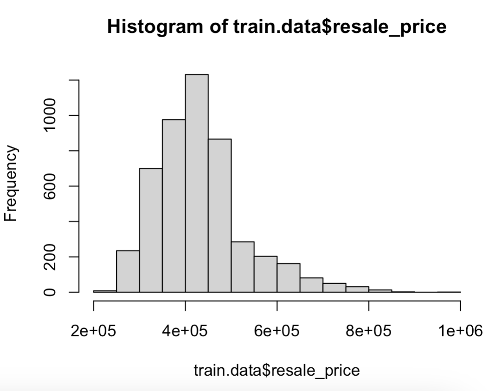
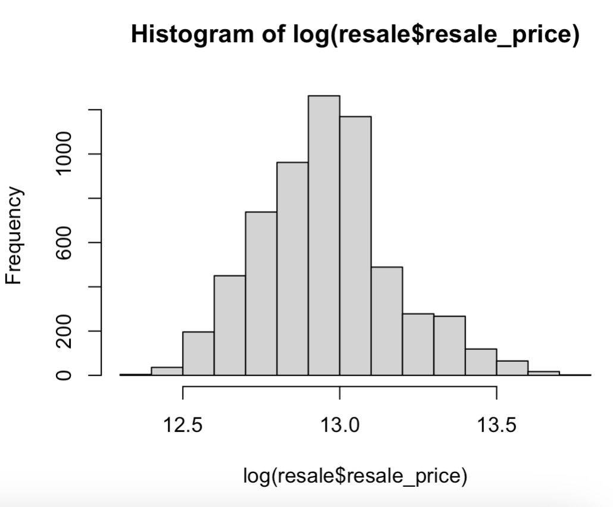
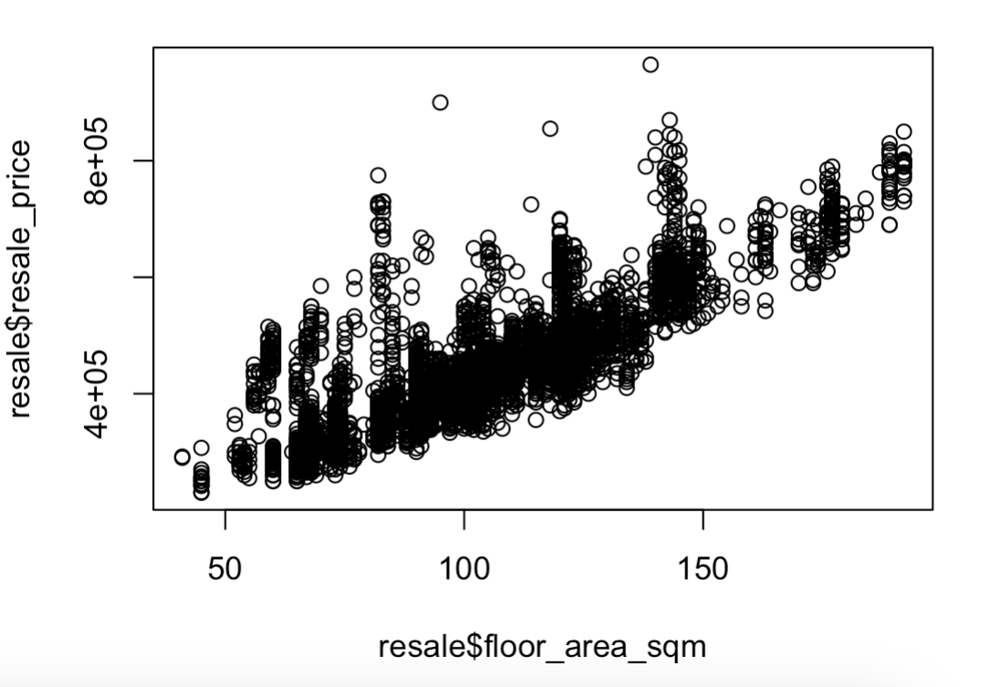
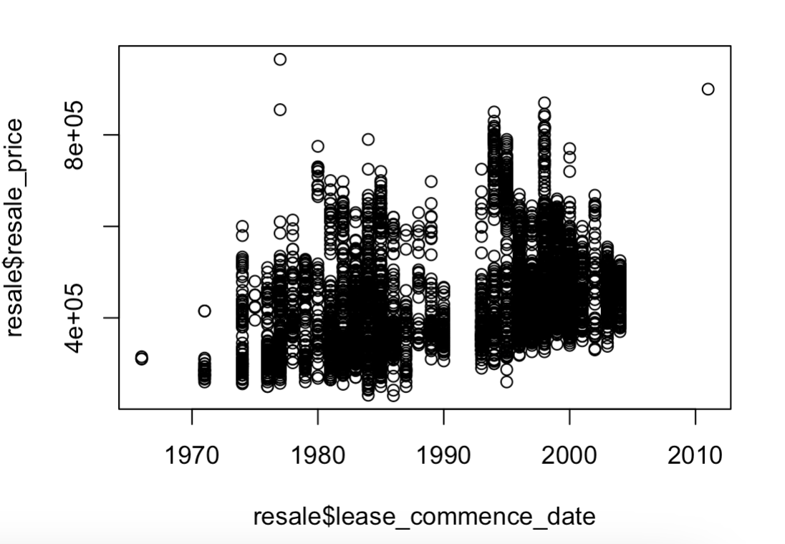

# TOPIC 3 - LINEAR REGRESSION

### Initialise working directory and read file

```r
setwd("/Users/yizhong/School/Y2S1/DSA1101/Data")
resale = read.csv("hdbresale_reg.csv")
```

### View sample data

```r
head(resale[ ,2:7]) # 1st column indicates ID of flats
```

| month   | town         | flat_type | block | street_name    | storey_range |
| ------- | ------------ | --------- | ----- | -------------- | ------------ |
| 2012-03 | CENTRAL AREA | 3 ROOM    | 640   | ROWELL RD      | 01 TO 05     |
| 2012-03 | CENTRAL AREA | 3 ROOM    | 640   | ROWELL RD      | 06 TO 10     |
| 2012-03 | CENTRAL AREA | 3 ROOM    | 668   | CHANDER RD     | 01 TO 05     |
| 2012-03 | CENTRAL AREA | 3 ROOM    | 5     | TG PAGAR PLAZA | 11 TO 15     |
| 2012-03 | CENTRAL AREA | 3 ROOM    | 271   | QUEEN ST       | 11 TO 15     |
| 2012-03 | CENTRAL AREA | 4 ROOM    | 671A  | KLANG LANE     | 01 TO 05     |

```r
head(resale[ ,8:11])
```

| floor_area_sqm | flat_model | lease_commence_date | resale_price |
| -------------- | ---------- | ------------------- | ------------ |
| 74             | Model A    | 1984                | 380000       |
| 74             | Model A    | 1984                | 388000       |
| 73             | Model A    | 1984                | 400000       |
| 59             | Improved   | 1977                | 460000       |
| 68             | Improved   | 1979                | 488000       |
| 75             | Model A    | 2003                | 495000       |

### Simple Linear Regression (SLR)

Suppose we have three observations. Each observation has an outcome $ y $ and an input variable $ x $. We are interested in the linear relationship:

$$
y_i \approx \beta_0 + \beta_1 x_i
$$

Since there is only **one** input variable, this is an example of a **simple linear model**.

### Modelling

```R
x = c( -1, 3, 5)
y = c( -1, 3.5 , 3)
lm(y~x)
```

```
Coefficients:
(Intercept)            x
     0.1250       0.7321
```

We can now write the **fitted model** as: $$\hat{y} = 0.125 + 0.7321x$$

### Predicting

With the fitted model, we can now obtain the fitted outcome (predicted outcome) value $ \hat{y} $ given any value of the predictor, $ x $.

For example, if $ x = 2$, then the fitted value for the outcome is:

$$\hat{y} = 0.125 + 0.7321 \times 2 = 1.589$$

```R
M = lm(y~x) # M = name of the fitted model
new = data.frame(x = 2) # create dataframe of new point
predict(M, newdata = new)
```

```
       1
1.589286
```

### Model for HDB Resale Flats

```R
price = resale$resale_price
area = resale$floor_area_sqm
hdb.model = lm(price ~ area)
hdb.model$coef # coefficients of the hdb model
```

Alternatively, for the modelling step:

```r
hdb.model = lm(price ~ area, data = resale)
```

(Intercept) area
115145.730 3117.212

````

The fitted model is then

$$\hat{y} = 115145.730 + 3117.212 \times area$$

where $y$ is the resale price of a flat, in SGD.

### Goodness-of-fit of Model

The goodness-of-fit of a model could be accessed by some measures. In this course, we consider only two basic measurements:

- The significance of the model by a test (F-test).
- Coefficient of determination, $R^2$.

When comparing the goodness-of-fit of two models with the **same response**, we can use Residual Standard Error (RSE) as a criterion.

### F-test

To test if the whole model is significant or not, we use F-test.

Its null hypothesis ($ H_0 $) states "model is NOT significant". Its alternative ($ H_1 $) states "model is significant". Equivalently:

- $ H_0 $ : all the coefficients, except intercept, are zero.
- $ H_1 $: at least one of the coefficients (except intercept), is NON-zero.

If the test has a small p-value (such as $ < 0.05 $), then data provide strong evidence against $ H_0 $. Otherwise, we cannot eliminate $ H_0 $.

```R
summary(hdb.model)
````

```
Call:
lm(formula = price ~ area)

Residuals:
    Min      1Q  Median      3Q     Max
-122852  -33539  -10984   17298  488719

Coefficients:
             Estimate Std. Error t value Pr(>|t|)
(Intercept) 115145.73    2949.14   39.04   <2e-16 ***
area          3117.21      27.95  111.54   <2e-16 ***
---
Signif. codes:  0 ‘***’ 0.001 ‘**’ 0.01 ‘*’ 0.05 ‘.’ 0.1 ‘ ’ 1

Residual standard error: 56410 on 6053 degrees of freedom
Multiple R-squared:  0.6727,	Adjusted R-squared:  0.6727
F-statistic: 1.244e+04 on 1 and 6053 DF,  p-value: < 2.2e-16
```

Notice the last line's extremely low p-value. That serves as strong evidence against $ H_0 $.

### Coefficient of Determination $ R^2 $

**Total sum of squares ($ TSS $)** measures the total variance in the response in the given data, and can be thought of as the amount of variability inherent in the response before the regression is performed.

$$
TSS = \sum\_{i=1}^{n} (y_i - \bar{y})^2
$$

**Residual sum of squares ($ RSS $)** measures the amount of variability that is left unexplained after performing the regression.

$$
RSS = \sum\_{i=1}^{n} (y_i - \hat{y_i})^2
$$

The quantity **$ R^2 $** (coefficient of determination) is defined as:

$$
R^2 = \frac{TSS - RSS}{TSS} = 1 - \frac{RSS}{TSS}
$$

$ R^2 $ measures the proportion of variability in the response Y that is explained by the fitted model. Larger$ R^2 $ indicates better model fit.

**Derieving $ R^2 $ directly:**

```R
TSS = var(y)\*(length(y) -1) # or
TSS = sum((y- mean (y)) ^2)

RSS =sum((y- M$fitted )^2)

R2 = 1 - RSS/TSS; R2
```

```
[1] 0.822407
```

**Getting $ R^2 $ from model output:**

```R
summary(M)$r.squared
```

```
[1] 0.822407
```

### Residual Standard Error (RSE):

RSE in **simple** linear regression is defined as:

$$
RSE = \sqrt{\frac{RSS}{n - p - 1}}
$$

For the same response, one may fit many different linear models, and the one with large RSE indicates poorer model fit.

```R
summary(M)$sigma
```

```
[1] 1.469937
```

### Multiple Linear Regression (MLR)

Suppose we have $ n $ observations. Each observation has an outcome $ y $ and multiple input variables $ x^1, \ldots, x^p $.

We are interested in the linear relationship:

$$
y \approx \beta_0 + \beta_1 x^1 + \beta_2 x^2 + \dots + \beta_p x^p
$$

or equivalently:

$$
y_i \approx \beta_0 + \beta_1 x_i^1 + \beta_2 x_i^2 + \dots + \beta_p x_i^p, \quad i = 1, \dots, n.
$$

The least squares estimates of $\beta_0, \beta_1, \beta_2, \dots, \beta_p $ are returned by the `lm()` function in R.

Consider a simulated data with $x^1,x^2$ and response $y$ where $y$ is created as $(1 + 2x^1 − 5x^2)$ with some noise added.

```R
set.seed(520)
x1 = rnorm(100)
x2 = rnorm(100)
y = 1 + 2*x1 -5*x2+ rnorm(100)
```

A fitted linear model, $y \sim x^1 + x^2$, can be obtained as such:

```R
lm(y~x1+x2)
```

```
Coefficients:
(Intercept)           x1           x2
      1.062        2.048       -5.197
```

### Adjusted $R^2$ in MLR

$ R^2 $ can be inflated simply by adding more regressors to the model (even insignificant terms).

We have adjusted $ R^2 $, denoted as $ R^2\_{adj} $, which penalizes the model for adding regressors of too little help to the model.

$$
R^2_{adj} = 1 - \frac{RSS / (n - p - 1)}{TSS / (n - 1)}
$$

When comparing two models of the same response, the model with the larger $ R^2\_{adj} $ is preferred.

```R
summary(some_model)$adj.r.squared
```

### Dividing Full Dataset into Train Set and Test Set Randomly

1. Mix up all the indices of the full data:

```R
n = dim(resale)[1] # total number of rows/observations

index.train = sample(1:n)[1:(0.8*n)]
```

- This 2nd line generates a random sample of indices from the range `1:n` (where n is the total number of observations).
- `1:n` generates a sequence from 1 to n.
- `0.8*n` specifies that you want to sample 80% of the total number of observations (which is often used to create a training dataset).

2. Take the first 80% of those mixed indices as indices of train data and the remaining 20% as indices of test data:

```R
train.data = resale[index.train, ]
test.data = resale[ - index.train, ]
```

3. Form the model based on the train set:

```R
M3 = lm(resale_price ~ floor_area_sqm, data = train.data)
summary(M3)
```

4. Predict the response for test set:

```R
prediction = predict(M3, test.data); prediction
```

5. View prediction (first column prediction while second column is the actual price):

```R
cbind(prediction, test.data$resale_price)
```

### Adding Categorical Variables to the MLR Model

**FOR THIS TO WORK, CONVERT VARIABLE TO CATEGORICAL IF IT IS NOT!**

```R
M4 = lm(resale_price ~ floor_area_sqm + flat_type, data = resale)
summary(M4)
```

```
Residuals:
    Min      1Q  Median      3Q     Max
-113637  -31066   -9668   15379  492762

Coefficients:
                   Estimate Std. Error t value Pr(>|t|)
(Intercept)        183375.6     8754.4  20.947  < 2e-16 ***
floor_area_sqm       1904.9       84.1  22.650  < 2e-16 ***
flat_type3 ROOM     24712.7     7934.2   3.115  0.00185 **
flat_type4 ROOM     42897.9     8651.9   4.958 7.31e-07 ***
flat_type5 ROOM     66198.2     9716.1   6.813 1.05e-11 ***
flat_typeEXECUTIVE 156561.4    11698.3  13.383  < 2e-16 ***
---
Signif. codes:  0 ‘***’ 0.001 ‘**’ 0.01 ‘*’ 0.05 ‘.’ 0.1 ‘ ’ 1

Residual standard error: 53500 on 6049 degrees of freedom
Multiple R-squared:  0.7058,	Adjusted R-squared:  0.7056
F-statistic:  2903 on 5 and 6049 DF,  p-value: < 2.2e-16
```

FLAT TYPE has 5 categories. R chooses `2 ROOM` as reference category, and this can be inferred from the fact that its coefficient is not given.

Coefficient 26753.48 of `3 ROOM` means:

- fixing other variables in the model, compared to a `2 ROOM` flat then on average, a `3 ROOM` flat is more expensive by $26753.48.

### Describing the Linear Model

For the linear model above:

```
resale_price_hat = 183375.6
                   + 1904.9 * floor_area_sqm
                   + 24712.7 * I(flat_type = "3 ROOM")
                   + 42897.9 * I(flat_type = "4 ROOM")
                   + 66198.2 * I(flat_type = "5 ROOM")
                   + 156561.4 * I(flat_type = "EXECUTIVE")
```

### Assumptions of Response to Form a Linear Model

1. Response should be a **quantitative** variable.
2. Response should be **symmetric**.
3. **Variability of response is stable when regressors change.**

### Checking for response symmetry (1)

At our level, checking the symmetry by histogram would be enough.

```R
hist(resale$resale_price) # if we plan to use full data to form model
hist(train.data$resale_price) # if we plan to use train.data to form the model
```

<div style="text-align: center;">
  
</div>

In both cases, the response is **NOT symmetric**, and is very **right skewed**. Hence, it's **NOT SUITABLE** to fit a linear model for resale price.

#### Solution for right-skewed response: Log Transformation

After transformation, such as taking log-e, the response is more symmetric.

```R
hist(log(resale$resale_price)) # slightly better, more symmetric
```

<div style="text-align: center;">
  
</div>

Hence, fitting a linear model for the $ log_e $ of the price is better than fitting a LM for the price itself.

### Checking for Stability of Variability of Response (2)

Use scatter plot of $ y $ vs quantitative $ x $, and check if the range of response is stable when $ x $ changes.

```r
plot(resale$floor_area_sqm, resale$resale_price)
```

<div style="text-align: center;">
  
</div>

---

```r
plot(resale$age, resale$resale_price)
```

<div style="text-align: center;">
  
</div>

#### Solution for increasingly varied response: Sqrt Transformation

After $\sqrt{y}$ transformation, we can reduce the variability of the responses on the right side.
