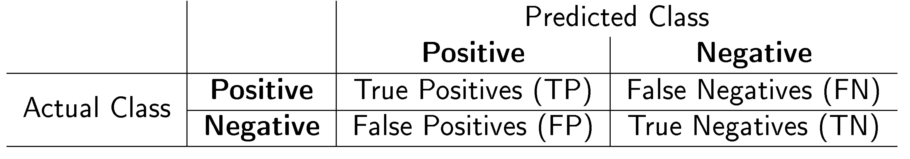
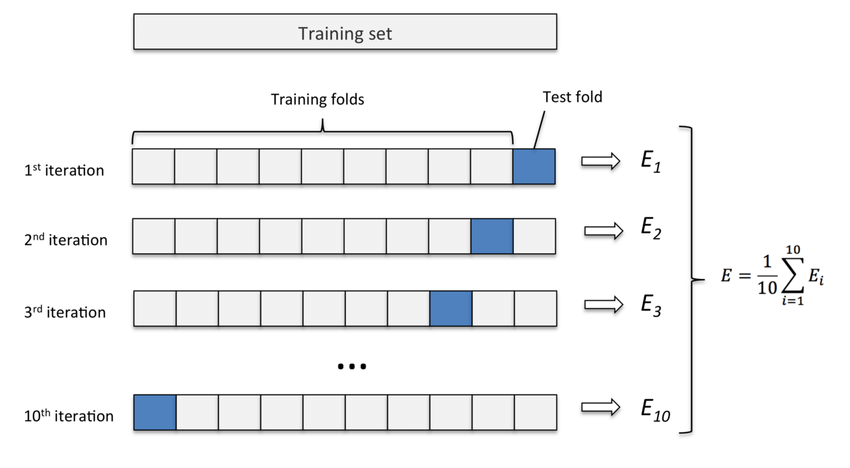

# TOPIC 4 - KNN

### Categorical Response

Many learning tasks involve the following: given the value of predictors $X$, make a good prediction of the outcome $y$ which we denote by $\hat{G}$.

In some cases, the outcome $y$ is categorical, which is typically represented numerically by codes. For example, a categorical outcome with binary response is often represented by $0$, $1$.

One approach is to treat the binary coded outcome $y$ as a quantitative variable to get the prediction. Then, assign a class label to $\hat{G}$ according to whether the prediction is larger than $\delta$, which is a constant in $(0, 1)$ and is chosen case by case.

### K-Nearest Neighbors Classification

There are $n$ training points with features $x$ and categorical response $y$. Each $(x_i, y_i)$ is the information of an observation.

With the information $x$, the prediction on the category for the response is denoted as $\hat{G}(x)$.

For simplicity, we only consider the cases of binary response $(0, 1)$ only. Hence, the prediction, $\hat{G}(x)$, is either $0$ or $1$.

---

The $k$-nearest neighbors method uses training points closest in feature space to $x$ to find:

$$
\frac{1}{k} \sum_{i \in \mathcal{N}_k(x)} y_i
$$

where $\mathcal{N}_k(x)$ is the neighborhood of $x$ defined as the set of $k$ closest points (in terms of Euclidean distance).

$\delta$ is a pre-chosen threshold, and the average above is converted to $\hat{G}(x)$ according to the rule

$$
\hat{G}(x) =
\begin{cases}
1, & \text{if it's } > \delta, \\
0, & \text{otherwise}.
\end{cases}
$$

---

<div style="text-align: center;">
  
</div>

Blue = 0, orange = 1. The $k$-nearest neighbors classification using $k = 3$.

Left:

- A new observation, marked with an “X”, is being classified.
- A green circle surrounds the new observation, representing the boundary of the 3-nearest neighbors.
- Inside this boundary, there are two blue points (class 0) and one orange point (class 1).
- The predicted outcome $\hat{Y}$ at the marked feature value is $\frac{1}{3}$, hence $\hat{G} = 0$.

Right: the $k$-nearest neighbors decision boundary.

---

For the K-NN diagrams, the purple dash line refers to **Bayes Decision**, which we regard as the gold standard.

<div style="text-align: center;">
  
</div>

When $k = 1$, the decision boundary is overly flexible and influenced by local features of a handful of training data points $\rightarrow$ low bias, high variance.

<div style="text-align: center;">
  
</div>

When $k = 100$, the method yields more stable but less flexible decision boundaries $\rightarrow$ high bias, low variance.

Note that large or small of $k$ is with respect to $n$:
$k = 50$ is large for $n = 100$, but small for $n = 100000$.

---

### Application: Stock Market Data

We will use the `knn()` function from the 'class' package in R to perform $k$-nearest neighbors classification and prediction. We need the following four inputs to `knn()`:

1. A matrix containing the predictors or features $x$ associated with the training data
2. A matrix containing the predictors or features $x$ associated with the data for which we wish to make predictions
3. A vector containing the class labels for the training data
4. A value for $k$, the number of nearest neighbors to be used by the classifier

The first 3 items are all retrieved from the dataset.

### Initialisation

Initialise working directory and read file:

```r
setwd("/Users/yizhong/School/Y2S1/DSA1101/Data")
market = read.csv("Smarket.csv")
```

Set seed for sample (randomiser) used later:

```r
set.seed(1)
```

Install and call the "class" package:

```r
install.packages("class")
library(class)
```

### View sample data

```r
summary(market[,2:10])
head(market)
```

```
  X Year   Lag1   Lag2   Lag3   Lag4   Lag5 Volume  Today Direction
1 1 2001  0.381 -0.192 -2.624 -1.055  5.010 1.1913  0.959        Up
2 2 2001  0.959  0.381 -0.192 -2.624 -1.055 1.2965  1.032        Up
3 3 2001  1.032  0.959  0.381 -0.192 -2.624 1.4112 -0.623      Down
4 4 2001 -0.623  1.032  0.959  0.381 -0.192 1.2760  0.614        Up
5 5 2001  0.614 -0.623  1.032  0.959  0.381 1.2057  0.213        Up
6 6 2001  0.213  0.614 -0.623  1.032  0.959 1.3491  1.392        Up
```

```r
dim(market)
```

```
[1] 1250   10
```

### Preparing Data to Form Model and to Test Model (Not Random Sampling)

Separate the data above to two parts:

1. One part is used to train the model. (years before 2005)

```r
# indexes of all the rows where Year <2005
index.train = which(market$Year <2005)

# create data that having rows before year 2005:
train.data = market[index.train, ]
```

2. One part is to test the model. (year 2005)

```r
# take all the rows where the indexes of those rows are not in "index.train".
test.data = market[-index.train , ] # take the year 2005 as test set
```

```r
dim(train.data) # [1] 998  10
dim(test.data) # [1] 252  10
```

### Forming a <u>Set of Features</u> for Training and for Testing

**Item 1** - A matrix containing the predictors or features $x$ associated with the training data:

```r
train.x = train.data[ ,c("Lag1","Lag2","Lag3","Lag4","Lag5")]
```

**Item 2** - A matrix containing the predictors or features $x$ associated with the data for which we wish to make predictions:

```r
test.x = test.data[ ,c("Lag1","Lag2","Lag3","Lag4","Lag5")]
```

Note that we only use the 5 lags as features where the magnitude of these 5 columns is the same. Hence, there is no need to standardize.

However, it is recommended to standardize the quantitative columns when their magnitude differ.

### Forming the <u>Response</u> for Training and for Testing

**Item 3** - A vector containing the class labels for the training data:

```r
train.y = train.data[ ,c("Direction")]
```

### Forming Model (Classifier)

**Item 4** - A value for $k$, the number of nearest neighbors to be used by the classifier: $k = 1$

```r
knn.pred = knn(train.x,test.x,train.y,k=1)
knn.pred
```

```
  [1] Down Up   Up   Down Down Down Up   Down Up   Down Up   Down Up   Down Down Up   Down Down Up   Down Up
 [22] Down Down Down Down Up   Up   Up   Up   Down Up   Down Down Up   Up   Down Up   Up   Up   Down Up   Up
 [43] Up   Up   Up   Down Up   Down Up   Up   Up   Up   Down Down Down Up   Down Up   Down Up   Down Up   Down
 [64] Up   Down Up   Down Down Down Down Down Up   Down Up   Up   Down Down Down Up   Down Up   Down Up   Down
 [85] Up   Down Up   Up   Down Up   Down Down Up   Up   Down Up   Down Down Down Up   Down Down Up   Up   Up
[106] Up   Up   Down Down Down Up   Up   Up   Up   Up   Down Up   Down Up   Down Up   Down Down Up   Up   Down
[127] Up   Down Up   Up   Up   Down Down Down Up   Up   Up   Up   Down Up   Down Up   Up   Up   Up   Down Down
[148] Down Up   Down Up   Up   Down Down Up   Down Up   Down Up   Up   Up   Down Up   Up   Up   Up   Up   Up
[169] Up   Down Up   Down Down Up   Up   Up   Up   Down Up   Down Up   Down Down Down Down Down Down Up   Up
[190] Up   Down Up   Down Down Down Up   Up   Up   Down Down Up   Down Down Down Up   Down Down Up   Up   Down
[211] Down Down Down Up   Down Down Up   Up   Down Down Down Up   Down Up   Up   Down Down Down Down Down Up
[232] Up   Down Up   Down Down Up   Up   Up   Up   Down Up   Up   Up   Down Up   Up   Down Down Up   Up   Up
Levels: Down Up
```

The values in `knn.pred` is the predicted response/class for the test points.

If we want to get the predicted probability (or proportions) of the winner class being the majority class for each test point, then we should add `prob = TRUE`.

```R
knn.pred = knn(train.x,test.x,train.y,k=1, prob = TRUE)
prob = attr(knn.pred, "prob") # this will be the predicted probability.
```

However, with $k = 1$, it will return a probability of 1 for the nearest neighbour's class since the winner class is the only point considered.

```
[1] 1 1 1 1 1 ...
```

### Testing Model

```
knn.pred = knn(train.x,test.x,train.y,k=1) # get the class label
test.y = test.data[ ,c("Direction")] # extracts the actual class labels from the test dataset
data.frame(test.y, knn.pred) # combines the true class label and predicted class label into one dataframe
```

```
    test.y knn.pred
1     Down     Down
2     Down       Up
3     Down       Up
4       Up     Down
5     Down     Down
6       Up     Down
7     Down       Up
        .
        .
        .
```

### Diagnostics (Understanding the Model)

When a classifier is built, it helps to assign class labels to person, item, or transaction. There is a need to evaluate its performance.

In general, for two class labels, $C$ and $C'$, where $C'$ denotes "not $C$", some working definitions and formulas follow:

- **True Positive**: Predict $C$, when actually $C$
- **True Negative**: Predict $C'$, when actually $C'$
- **False Positive**: Predict $C$, when actually $C'$
- **False Negative**: Predict $C'$, when actually $C$

### Confusion Matrix

</br>
<div style="text-align: center;">
  
</div>

TP and TN are the correct predictions. A good classifier should have large TP and TN; and has small numbers (ideally zero) for FP and FN.

---

To generate a confusion matrix for our model above:

```r
confusion.matrix = table(test.y, knn.pred)
confusion.matrix
```

```
      knn.pred
test.y Down Up
  Down   55 56
  Up     66 75
```

55 Downs were predicted correctly; 75 Ups were predicted correctly.
The rest (56 + 66) were predicted wrongly by the KNN classifier where $k = 1$.

### Metrics for Diagnostics of Classifiers

There are many criteria to evaluate. For now, we consider 5 basic measurements below:

1. Accuracy
2. True Positive Rate (TPR)
3. False Positive Rate (FPR - Type I error)
4. False Negative Rate (FNR - Type II error)
5. Precision

A well-performed classifier should have a high TPR (ideally 1) and a low FPR and FNR (ideally 0).

### Accuracy

The **accuracy** (or the overall success rate) is a metric defining the rate at which a model has classified the records correctly.

It is defined as the sum of TP and TN divided by the total number of instances:

$$
\text{Accuracy} = \frac{TP + TN}{TP + TN + FP + FN} \times 100\%
$$

A good model should have a high accuracy score, but having a high accuracy score alone does not guarantee the model is well established.

---

To find the accuracy of our model above:

```r
sum(diag(confusion.matrix))/sum(confusion.matrix) # 0.515873
```

\(\text{Accuracy} = (55+75)/252 \approx 51.59 \%\)
Which means that 51.59% of the observations are correctly predicted.

### True Positive Rate

The true positive rate (TPR) shows the proportion of positive instances the classifier correctly identified:

$$
\text{TPR} = \frac{TP}{TP + FN}
$$

### False Positive Rate

The true positive rate (TPR) shows the proportion of positive instances the classifier correctly identified, and is also called the false alarm rate or **Type I error rate**:

$$
\text{FPR} = \frac{FP}{FP + TN}
$$

### False Negative Rate

The false negative rate (FNR) shows the percent of positives the classifier marked as negatives and is also known as the miss rate or **Type II error rate**.

$$
\text{FNR} = \frac{FN}{FN + TP}
$$

### Precision

Precision is the percentage of instances that are actually positive among the marked positives:

$$
\text{Precision} = \frac{TP}{TP + FP}
$$

### Model for KNN with $k = 10$

```r
knn.pred = knn(train.x,test.x,train.y,k=10)
confusion.matrix=table(knn.pred, test.y)
confusion.matrix
sum(diag(confusion.matrix))/sum(confusion.matrix) # 0.5357143
```

Notice that the accuracy is slightly higher.

### N-fold Cross Validation

<div style="text-align: center;">
  
</div>

1. The entire data set is randomly split into $N$ data sets of approximately equal size.
2. $(N-1)$ of these data sets are treated as the training data set, while the remaining one is the test data set. A measure of the model error is obtained.
3. This process is repeated across the various combinations of $N$ data sets taken $(N-1)$ at a time.
4. The observed $N$ models' errors are averaged across the $N$ folds.

---

### 5-fold Cross-Validation for KNN with \(k=1, 5, 10\)

1. Extract the **features** and **response**:

```r
X = market[,c("Lag1","Lag2","Lag3","Lag4","Lag5")] # columns of features
Y = market[,c("Direction")] # response
```

2. Create sample:

```r
n_folds=5

# dim(market)[1] gives number of rows
# gives a vector containing equal number of 1s to 5s, shuffled
folds_j <- sample(rep(1:n_folds, length.out = dim(market)[1]))
table(folds_j)
```

```
folds_j
  1   2   3   4   5
250 250 250 250 250
```

3. Create vector to store error rate and accuracy of each fold:

```r
err=numeric(n_folds)
acc=numeric(n_folds)
```

4. Loop through each fold to populate error rate and accuracy:

```r
for (j in 1:n_folds) {
    test_j <- which(folds_j == j) # vector of indices corresponding to the fold

    train.x = X[-test_j, ] # item 1
    test.x = X[test_j, ] # item 2
    train.y = Y[-test_j ] # item 3

    # KNN with k = 1, 5, 10, etc
    pred <- knn(train.x, test.x, train.y, k=1)

    # Y[test_j] == pred returns a logical vector (TRUE == 1, FALSE == 0)
    err[j]=mean(Y[test_j] != pred)
    acc[j]=mean(Y[test_j] == pred)
}
```

---

```r
error=mean(err); error # this is the avarage error rate over 5 folds
```

```r
accur=mean(acc); accur # this is the avarage accuracy over 5 folds
```

### Random Splitting of Original Data

```r
# number of rows/observations in original data
n = dim(market) # n = 1250

# number of points in train set
n1 = floor(n/10*8) # n1 = 1000

# number of points in test set
n2 = n - n1 # n2 = 250

# label 1 is for train set; label 2 is for test set.
label = c(rep(1, n1), rep(2, n2))

# shuffle the order of labels
label = sample(label)

# get the index of the points that will be in the test set
test.row <- which(label == 2)

# get all the test and train rows seperately
test.set = market[test.row, ]
train.set = market[-test.row, ]
```
