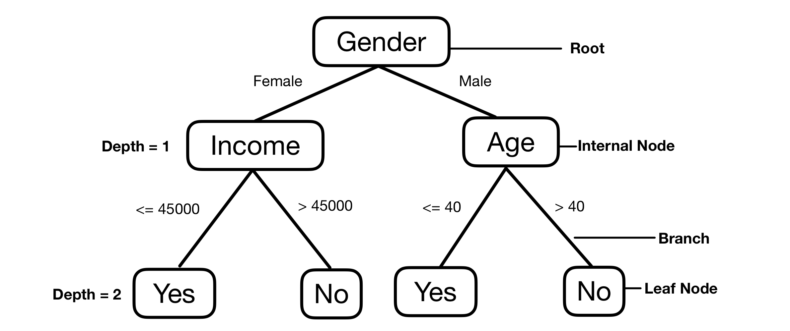
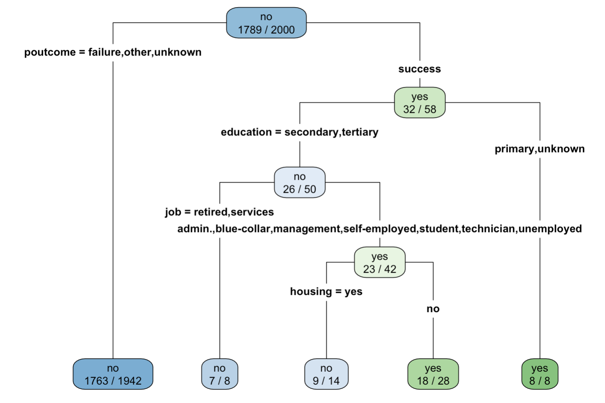

# TOPIC 5 - Decision Tree

### Overview on Decision Trees

Decision tree is a classification method. We focus on the **classification tree**, where the output is categorical.

Given a set of **features** $X = (x_1, x_2, ..., x_p)$, the goal is to predict a **response** or **output variable** $Y$ (categorical).

Each member of the set $(x_1, x_2, ..., x_p)$ is called an **input variable** or a **feature** which could be categorical or continuous.

### Example of Decision Tree

<div style="text-align: center;">
  
</div>

1. **Nodes**:
   - These represent test points where decisions are made.
   - **Root Node**:
     - The topmost internal node, from which the tree starts.
   - **Internal Nodes**:
     - These represent decision or test points based on input variables or attributes.
     - Usually two branches, but might be more than two.
   - **Leaf Nodes**:
     - Nodes without further branches.
     - They return class labels (response) or, in some cases, probability scores.
2. **Branches**:

   - The outcomes of decisions, represented as lines connecting nodes.
   - The branching of a node is referred to as a **split**.
   - For numerical decisions:
     - The "greater than" branch is usually placed on the right.
     - The "less than" branch is placed on the left.
     - Sometimes, one of the branches may include an "equal to" component. (Usually on the left)

3. **Depth of a Node**:
   - The minimum number of steps required to reach the node from the root.

### Application: Term Deposit Clients

Given the demographics of clients and their reactions to previous campaign phone calls, the bank's goal is to predict which clients would subscribe to a term deposit.

- The variables include (1) job, (2) marital status, (3) education level, (4) if the credit is in default, (5) if there is a housing loan, (6) if the customer currently has a personal loan, (7) contact type, (8) result of the previous marketing campaign contact (poutcome), and finally (9) if the client actually subscribed to the term deposit. All variables are categorical.
- Attributes (1) through (8) are the input variables or features.
- (9) is considered the (binary) outcome: The outcome subscribed is either yes (meaning the customer will subscribe to the term deposit) or no (meaning the customer won't subscribe).

### Initialisation

Initialise working directory and read file:

```r
setwd("/Users/yizhong/School/Y2S1/DSA1101/Data")
bankdata = read.csv("C:/Data/bank-sample.csv", header = TRUE)
```

Install and call the "rpart" package:

```r
install.packages("rpart")
library("rpart")
```

### Building the Decision Tree

The `rpart` method:

```r
fit <- rpart([response] ~ [features...],
  method="class",
  data=[dataframe],
  control=rpart.control(minsplit=1), # minimum number of observations that must exist in a node for a split
  parms=list(split='information')
)
```

Note that there are few other arguments instead of `minsplit` in `rpart.control`:

- `cp`:smaller values of cp correspond to decision trees of larger sizes, and hence more complex decision surfaces.
- `maxdepth`

Example:

```r
fit <- rpart(subscribed ~ job+marital+education+default
                          +housing+loan+contact+poutcome,
  method="class",
  data=bankdata,
  control=rpart.control(minsplit=1),
  parms=list(split='information')
)
```

### Visualising the Decision Tree

<div style="text-align: center;">
  
</div>

```r
rpart.plot(fit, type=4, extra=2)

rpart.plot(fit, type=4, extra=2, varlen=0, faclen=0, clip.right.labs=FALSE)
```

Note:

- `varlen`: length of variable's name,varlen = 0 means full name of input variables is shown.
- `faclen`: length of category's name, faclen = 0 means full name of categories.
- `clip.right.labs`: TRUE means don't print the name of variable for the right stem.

### Choosing the Most Informative Attribute

A common way to identify the most informative attribute is to use entropy-based methods, based on two measurements:

- **Entropy**, which measures the impurity of an attribute
- **Information gain**, which measures the reduction in impurity (if a split is made)

#### Purity

- The _purity_ of a node is defined as its probability of the corresponding class.
- For example, in the top of the decision tree built earlier,
  $$ P(\text{subscribed} = 0) = \frac{1789}{2000} \approx 89.45\% $$
- Therefore, it is 89.45% pure on the ($\text{subscribed} = 0$) class and 10.55% pure on the ($\text{subscribed} = 1$) class.

#### Entropy

Heuristically, entropy is a measure of unpredictability.

Given variable $Y$ and the set of possible categorical values it can take, $(y_1, y_2, \dots, y_K)$, the entropy of $Y$ is defined as:

$$
D_Y = -\sum_{j=1}^{K} P(Y = y_j) \log_2 P(Y = y_j),
$$

where $P(Y = y_j)$ denotes the purity or the probability of the class $Y = y_j$, and $\sum_{j=1}^{K} P(Y = y_j) = 1.$

---

If the variable $Y$ is binary and only takes on two values 0 or 1, the entropy of $Y$ is:

$$
\{P(Y = 1) \log_2 P(Y = 1) + P(Y = 0) \log_2 P(Y = 0)\}.
$$

For example, let $Y$ denote the outcome of a coin toss, $Y = 1$ for head; $Y = 0$ for tail.

- If the coin is a fair one, then $P(Y = 0) = P(Y = 1) = \frac{1}{2}$, then the entropy is:

  $$
  \{0.5 \log_2 0.5 + 0.5 \log_2 0.5\} = 1.
  $$

- If the coin is biased, suppose $P(Y = 0) = \frac{3}{4}, P(Y = 1) = \frac{1}{4}$, the entropy is now:

$$
\{0.25 \log_2 0.25 + 0.75 \log_2 0.75\} \approx 0.81.
$$

When the coin is biased, we have less uncertainty" in predicting the outcome of its next toss, so that the entropy is lower. When the coin is fair, we are much more less able to predict the next toss, and so the entropy is at its highest value.

### Calculating conditional entropy when 'poutcome' is splitted

# as x1 = failure, other, unknown and x2 = success

x1=which(bankdata$poutcome!="success") # index of the rows where poutcome = x1
length(x1) # 1942 rows that the value of poutcome = x1.

x2=which(bankdata$poutcome=="success") # index of the rows where poutcome = x2
length(x2) # 58 rows that the value of poutcome = x2 = success

table(bankdata$subscribed[x1])

# counting how many "yes" and how many "no" for Subscribed among those with poutcome = x1

# among 1942 customers with poutcome = x1, 179 subscribed (179 yes), and 1763 no.

table(bankdata$subscribed[x2])

# counting how many "yes" and how many "no" for Subscribed among those with poutcome = x2

# among 58 customers with poutcome = x2, 32 subscribed (32 yes), and 26 no.

### Calculating conditional entropy when 'poutcome' is splitted

# as x1 = success, other, unknown and x2 = failure

x1=which(bankdata$poutcome!="failure")
x2=which(bankdata$poutcome=="failure")
table(bankdata$subscribed[x1])
table(bankdata$subscribed[x2])

############ PLAYING GOLF EXAMPLE

library("rpart") # load libraries
library("rpart.plot")

play_decision <- read.table("DTdata.csv",header=TRUE,sep=",")
head(play_decision)

fit <- rpart(Play ~ Outlook + Temperature + Humidity + Wind,
method="class",
data=play_decision,
control=rpart.control(minsplit=1),
parms=list(split='information'))

rpart.plot(fit, type=4, extra=2)

# PREDICT THE DECISION FOR TWO DAYS:

newdata <- data.frame(Outlook= c("rainy", "sunny"), Temperature= c("mild","hot"),
Humidity=c("high", "normal"), Wind=c(FALSE, TRUE))
newdata

predict(fit,newdata=newdata,type="prob") # get the probability

# to get the probabilioty in numeric, we use:

p = predict(fit,newdata=newdata,type="prob")
as.numeric(paste(p))

predict(fit,newdata=newdata,type="class") # getthe class

pred = predict(fit, newdata = play_decision[,-1], type = "class")

######
