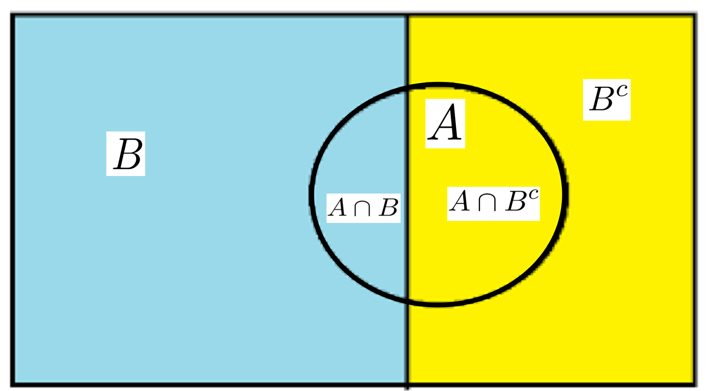
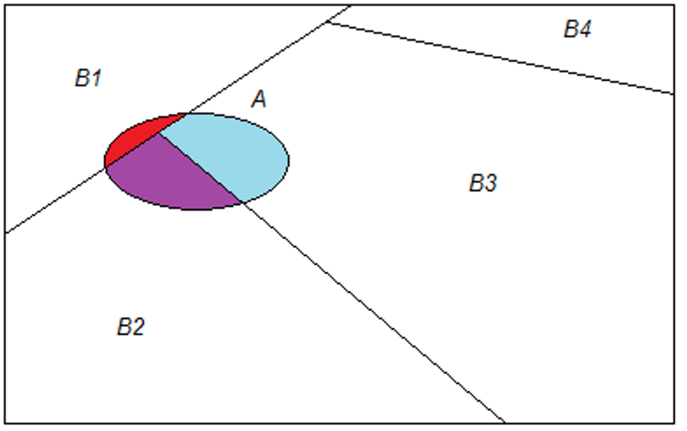

# TOPIC 6 - The Naïve Bayes Classifier

### Introduction

- Naïve Bayes is a probabilistic classification method based on Bayes’ theorem (or Bayes’ law).
- Bayes’ theorem gives the relationship between the probabilities of two events and their conditional probabilities.

### Conditional Probabiltiy

Suppose we have two events A and B within a sample space S. The conditional probability of A given B is defined to be:

$$
P(A|B) = \frac{P(A \cap B)}{P(B)}
$$

when $P(B) > 0$

### Law of Total Probability

<div align="center">
  
</div>

Law of total probability for the simple case: Let $ B $ denote an event and $ B^c $ denote the complement of $ B $. For any event $ A $ we then have:

$$
P(A) = P(A \cap B) + P(A \cap B^c).
$$

---

<div align="center">
  
</div>

For general: If $ B_1, B_2, \ldots, B_k $ are mutually exclusive where the union of them fulfills the whole sample space, then for any event $ A $, we have:

$$
P(A) = P(A \cap B_1) + P(A \cap B_2) + \ldots + P(A \cap B_k)
$$

### Bayes’ Theorem

The conditional probability of event $ A $ occurring, given that event $ B $ has already occurred, is denoted as $ P(A|B) $, which is defined as

$$
P(A|B) = \frac{P(A \cap B)}{P(B)} = \frac{P(B|A) \times P(A)}{P(B)},
$$

where $ P(B \cap A) = P(A \cap B) $ is the probability that both events $ B $ and $ A $ occur.

Bayes’ theorem is significant because quite often $ P(A|B) $ is much more difficult to compute than $ P(B|A) $ and $ P(A) $ from the training data.

### Naïve Bayes Classifier

A naive Bayes classifier assumes that the effect of each feature on the response (whether or not the object belongs to the class label) is independent of each other.

The input variables are **generally categorical**, but variations of the algorithm can accept continuous variables.

There are also ways to convert a continuous variable into a categorical one. This process is often referred to as the discretization of continuous variables. (Different ranges are of different categories)

### Bayes Theorem for Naïve Bayes Classifier

Suppose the categorical outcome variable $ Y $ takes on values in the set $\{y_1, y_2, \ldots, y_k\}$. For example, binary response $ Y $ has $ k = 2 $.

Given $ m $ features $ X = \{X_1, X_2, \ldots, X_m\} $, we would need to calculate the probability that the object belongs to each category of the response, $ P(Y = y_j|X) $, where $ j = 1, 2, \ldots, k $.

Then, the object will be classified to the category $ y_j $ with the largest probability $ P(Y = y_j|X) $.

---

1. With Bayes Theorem, we have:

$$
P(Y = y_j|X) = \frac{P(X_1 = x_1, X_2 = x_2, \ldots, X_m = x_m|Y = y_j) \times P(Y = y_j)}{P(X_1 = x_1, X_2 = x_2, \ldots, X_m = x_m)}, \quad j = 1, 2, \ldots, k
$$

</br>

2. Simplify the numerator with **conditional independence assumption**:

$$
\begin{align*}
P(X_1 = x_1, X_2 = x_2, \ldots, X_m = x_m|Y = y_j)
& = P(X_1 = x_1|Y = y_j) \cdot P(X_2 = x_2|Y = y_j) \cdots P(X_m = x_m|Y = y_j) \\
& = \prod_{i=1}^{m} P(X_i = x_i|Y = y_j).
\end{align*}
$$

</br>

3. Ignore the term in the denominator, as it is constant (the same) for all response categories. Hence, for $ j = 1, 2, \ldots, k $, we have

$$
P(Y = y_j|X) \propto P(Y = y_j) \times \prod_{i=1}^{m} P(X_i = x_i|Y = y_j)
$$

$ P(Y = y_j) $ is known from the data, and each $ P(X_i = x_i|Y = y_j) $ is calculable given the data.

---

When looking at problems with a large number of feature values, or outcome with many categories, the conditional probability can become very small in magnitude (close to zero).

A way to alleviate the problem is to compute the logarithm of the probability scores:

$$
\log P(Y = y_j) + \sum_{i=1}^{m} \log P(X_i = x_i | Y = y_j)
$$

for $j = 1, 2, \dots, k$.

### Initialisation

Initialise working directory and read file:

```r
setwd("/Users/yizhong/School/Y2S1/DSA1101/Data")
sample <- read.table("sample1.csv",header=TRUE,sep=",")
```

Install and call the "e1071" package:

```r
install.packages("e1071")
library(e1071)
```

Install and call the "ROCR" package for plotting of ROC curve:

```r
install.packages("ROCR")
library(ROCR)
```

The sample has 14 rows filled, and the 15th row's `Enrolls` field is not filled.

```
        Age   Income   JobSatisfaction      Desire   Enrolls
1      <=30     High                No        Fair        No
2      <=30     High                No   Excellent        No
3  31 to 40     High                No        Fair       Yes
                                  ...
15     <=30   Medium               Yes        Fair
```

### Using Package `e1071` to Form Naïve Bayes Classifier

Forming the model:

```r
traindata = sample[1:14,]
testdata = sample[15,]

model <- naiveBayes(Enrolls ~ Age + Income + JobSatisfaction + Desire, traindata)
```

Predicting **probability** using the model:

```r
results <- predict(model, testdata, "raw")
```

Predicting **class label** using the model:

```r
results <- predict(model,testdata,"class")
```

### Additional Example (Bank)

Reading the file:

```r
banktrain <- read.csv("bank-sample.csv", header=TRUE)
banktest <- read.csv("bank-sample-test.csv")
```

Remove unnecessary columns:

```r
drops <- c("balance", "day", "campaign", "pdays", "previous", "month")
banktrain <- banktrain[,!(names(banktrain) %in% drops)]
banktest <- banktest[,!(names(banktest) %in% drops)]
```

Forming model (on `subscribed` and depending on all other features):

```r
nb_model <- naiveBayes(subscribed ~ . , data = banktrain)
```

`banktest` has a total of 11 columns, and the 11th is the response.

Predicting the response for banktest, it is recommended to take out the response column as the table was formed with the response depending on **all** columns.

```r
nb_prob_prediction <- predict(nb_model, newdata = banktest[ , -11], type ='raw')

nb_class_prediction <- predict(nb_model, newdata = banktest[ , -11], type ='class')

# rounding the probabilities to 3 decimal places
predicted.response = round(nb_prob_prediction, digits = 3)
```

```
        no   yes
[1,] 0.991 0.009
[2,] 0.964 0.036
[3,] 0.994 0.006
[4,] 0.974 0.026
        .
        .
        .
```

Note:

- `nb_prob_prediction` is the predicted response for the test set which includes the **raw probability** of no/yes for each point.
- `nb_class_prediction` is the **actual predicted class** of no/yes for each point with the **majority rule**.

Compare the predicted probability with the real response:

```r
cbind(predicted.response, banktest[  , ncol(banktest)])
```

```
     no      yes
[1,] "0.991" "0.009" "no"
[2,] "0.964" "0.036" "no"
[3,] "0.994" "0.006" "no"
[4,] "0.974" "0.026" "no"
[5,] "0.886" "0.114" "no"
[6,] "0.997" "0.003" "no"
            .
            .
            .
```

### Plotting ROC Curve for Naïve Bayes Classifier

By default, the threshold for classification is 0.5 (majority rule). However, we can vary the threshold to increase the **goodness of fit** of the classifier with a **large TPR** (close to 1) and a **small FPR** (close to 0).

A useful metric is to compute the Area Under the ROC Curve, AUC. Higher AUC scores mean the classier performs better.

AUC is also used to compare between Naïve Bayes method with other methods such as linear model, logistic model, DT, etc.

<div align="center">
  
</div>

Extract probability of positive response, and **TRUE** classification:

```r
score <- nb_prob_prediction[, c("yes")]
actual_class <- banktest$subscribed == 'yes'
```

Create prediction object to "format" the input:

```r
pred <- prediction(score , actual_class)
```

Calculate performance metrics for the prediction object:

```r
perf <- performance(pred , "tpr", "fpr")
```

Plot ROC curve:

```r
plot (perf, lwd =2) # lwd is to specify how thick the curve is
abline (a=0, b=1, col ="blue", lty =3)
```

Compute AUC:

```r
auc <- performance(pred , "auc")@y.values[[1]]
```

Visualize how threshold changes will change TPR and FPR:
Note that threshold is denoted as "alpha" in R.

```r
# Generate a vector of thresholds, and their FPR, TPR values.
threshold <- round(as.numeric(unlist(perf@alpha.values)), 4)
fpr <- round(as.numeric(unlist(perf@x.values)), 4)
tpr <- round(as.numeric(unlist(perf@y.values)), 4)

# View data
cbind(threshold, tpr, fpr)

# Plot FPR and TPR against the thresholds.
par(mar = c(5, 5, 2, 5)) # margin to make space for axis labels
plot(threshold, tpr, xlab="Threshold", xlim=c(0 ,1),
     ylab="True positive rate ", type="l", col="blue")
par(new ="True")
plot(threshold, fpr, xlab="", ylab="", axes=F, xlim=c(0, 1),
     type="l", col="red" )

axis(side=4) # to create an axis at the 4th side
mtext(side=4, line=3, "False positive rate")

# Vary the first and second arguments to set coordinates of labels
text(0.4, 0.05, "FPR", col="red")
text(0.6, 0.35, "TPR", col="blue")
```

############# EXAMPLE 1: CLASSIFYING FRUITS

fruit.dat= read.csv("fruit.csv")
#Long: 1 = Yes, 0 = No
#Sweet: 1 = Yes, 0 = No
#Yellow: 1 = Yes, 0 = No
fruit.dat<- data.frame(lapply(fruit.dat, as.factor))
head(fruit.dat)
attach(fruit.dat)

table(Long)
table(Sweet)
table(Yellow)

model <- naiveBayes(Fruit ~ Long+Yellow+Sweet,fruit.dat)

newdata <- data.frame(Long=1,Sweet=1, Yellow=0)
newdata <- data.frame(lapply(newdata, as.factor))

results <- predict (model,newdata,"raw")
results

results <- predict (model,newdata,"class") # default setting
results
