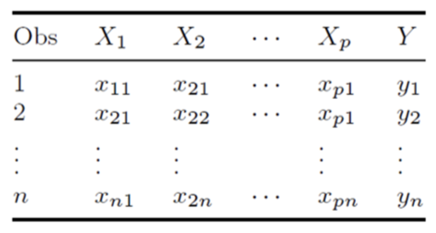

# TOPIC 7 - Logistic Regression

### Notations

Assume we have a set of $n$ observations used to build a model.

We have $p$ features, $X_1, ..., X_p$ in general.

The outcome variable $Y$ is binary with two values, $0$ and $1$. Need to convert catergorical response with 2 values into $0$ and $1$.

<div align="center">
  
</div>

### Introduction

If we assume $Y = 1$ as a success, then $P(Y = 1) = p$ is the success probability. The odds of success is then defined as:
$$\frac{p}{1 - p}$$

We then consider the model for the log-odds, or called "logit":  
 $$\log\left(\frac{p}{1 - p}\right) = \beta_0 + \beta_1 X_1 + \ldots + \beta_p X_p.$$

If $X_1$ is quantitative, then keeping other features constant, for each unit increased in $X_1$, the log odds increases by $\beta_1$.

From the logit equation, we can have the equivalent version:  
 $$p = \frac{e^{\beta_0 + \beta_1 X_1 + \ldots + \beta_p X_p}}{1 + e^{\beta_0 + \beta_1 X_1 + \ldots + \beta_p X_p} }.$$

Regardless of the values of the features, the range for $p$ is always between $0$ and $1$.

Instead of the method of ordinary least squares (OLS), parameter estimation for $\beta_0, \beta_1,...,\beta_p$ in logistic regression is based on the method called Maximum Likelihood Estimation (MLE).

### Initialisation

Initialise working directory and read file:

```r
setwd("/Users/yizhong/School/Y2S1/DSA1101/Data")
data = read.csv("churn.csv")
```

Set the 2 catergoical variables and remove the ID column.

```r
data$Churned = as.factor(data$Churned)
data$Married = as.factor(data$Married)
data= data[,-1] # Remove ID column
```

### Forming the Logistic Model

Specify `family = binomial` to form a logistic model instead of a linear model.

```r
M1<- glm( Churned ~., data = data,family = binomial)
summary(M1)
```

```
Coefficients:
                  Estimate Std. Error z value Pr(>|z|)
(Intercept)       3.415201   0.163734  20.858   <2e-16 ***
Age              -0.156643   0.004088 -38.320   <2e-16 ***
Married1          0.066432   0.068302   0.973    0.331
Cust_years        0.017857   0.030497   0.586    0.558
Churned_contacts  0.382324   0.027313  13.998   <2e-16 ***
---
Signif. codes:  0 ‘***’ 0.001 ‘**’ 0.01 ‘*’ 0.05 ‘.’ 0.1 ‘ ’ 1
```

The logistic equation can be constructed as such:

$$
\log\left(\frac{\hat{p}}{1 - \hat{p}}\right) = 3.415 - 0.157 \cdot \text{Age} + 0.06664 \cdot I(\text{Married} = 1) + 0.0179 \cdot \text{Cust\_Years} + 0.3824 \cdot \text{Churned\_Contacts}
$$

The column `Pr(>|Z|)` indicate the p-value for a test to test the significance of the coefficient in the fitted model. The smaller the value, the more significant the coefficient.

---

Refitting the model without `Cust_years` as it is the least significant:

```r
M2<- glm(Churned ~ Age + Married + Churned_contacts,
  data = data,family = binomial)
summary(M2)
```

```
Coefficients:
                  Estimate Std. Error z value Pr(>|z|)
(Intercept)       3.472062   0.132107  26.282   <2e-16 ***
Age              -0.156635   0.004088 -38.318   <2e-16 ***
Married1          0.066430   0.068299   0.973    0.331
Churned_contacts  0.381909   0.027302  13.988   <2e-16 ***
---
Signif. codes:  0 ‘***’ 0.001 ‘**’ 0.01 ‘*’ 0.05 ‘.’ 0.1 ‘ ’ 1
```

---

Refitting the model without `Married` as it is now the least significant:

```r
M3<- glm(Churned ~ Age + Churned_contacts, data = data,family = binomial)
summary(M3)
```

```
Coefficients:
                  Estimate Std. Error z value Pr(>|z|)
(Intercept)       3.502716   0.128430   27.27   <2e-16 ***
Age              -0.156551   0.004085  -38.32   <2e-16 ***
Churned_contacts  0.381857   0.027297   13.99   <2e-16 ***
---
Signif. codes:  0 ‘***’ 0.001 ‘**’ 0.01 ‘*’ 0.05 ‘.’ 0.1 ‘ ’ 1
```

Note that even if the **intercept** has a large p-value, we will still keep it.

### Predicting with Logistic Model

```r
predict(M3, newdata = data.frame(Age = 50, Churned_contacts = 5), type = 'response')
```

- `type = 'response'`:Return $P(Y = 1)$, the predicted probability for the event.
- `type = 'link'` (default): Return $\log\left(\frac{p}{1 - p}\right)$, log-odds.
- `type = 'terms'`: Return predictions for each term in the model, allowing for an understanding of how each feature contributes to the prediction.
