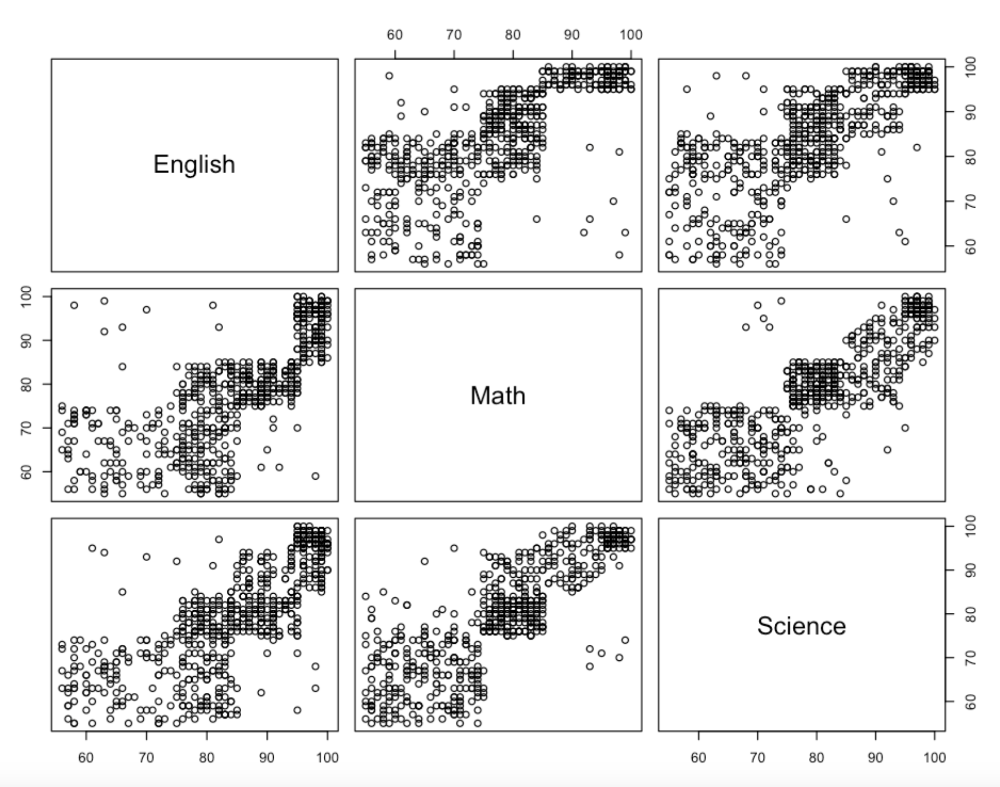

# TOPIC 8 - K-Means

### Unsupervised Learning

Suppose we only have data on the predictors $x$, but not the outcome $y$. We call such data without $y$ as 'unlabeled' data.

Unsupervised learning is the task of finding hidden structure based on data without the outcome $y$.

### Clustering Methods

Clustering Methods refer to a very broad set of techniques for finding subgroups, or clusters, in a data set.

When we cluster the observations of a data set, we seek to partition them into distinct groups so that the observations within each group are quite similar to each other, while observations in different groups are quite different from each other.

### Notation

We have a data set of $n$ observations with $p$ features.
We'll build a classifier that helps to put n observations into $k$ clusters.
Determining the value of $k$ is somehow subjective. Visualizing the data will give a better option for $k$.

### Initialisation

Initialise working directory and read file:

```r
setwd("/Users/yizhong/School/Y2S1/DSA1101/Data")
hdb = read.csv("hdbresale_cluster.csv")
```

```r
head(hdb)
```

```
    X flat_type floor_area_sqm amenities
1 580    3 ROOM             74        32
2 581    3 ROOM             74        37
3 582    3 ROOM             73        34
4 583    3 ROOM             59        38
5 584    3 ROOM             68        39
6 586    3 ROOM             68        36
```

The data has only 3 room flats.

```r
plot(x=hdb$floor_area_sqm, y=hdb$amenities,
     xlab="Floor area in sqm", ylab="Number of amenities", col="red")
```

<div align="center">
  
</div>

For this data set, it appears that there are **two** clusters, one in the **higher number of amenities group** and the other in the **lower number of amenities group**.

### Forming the clusters

Use `centers` to specifiy number of clusters.

```r
kout <- kmeans(hdb[, c("floor_area_sqm","amenities")], centers=2)
```

To visualise the clusters:

```r
plot(hdb$floor_area_sqm, hdb$amenities, col=kout$cluster)
```

<div align="center">
  
</div>

The centroids (with mean of all feature values in the cluster) of the clusters:

```r
kout$centers # A matrix of cluster centers.
```

```
  floor_area_sqm amenities
1       65.40782 37.279330
2       69.46017  7.448739
```

To find the cluster each point is allocated to:

```r
kout$cluster # A vector of integers (from 1:k) indicating the cluster to which each point is allocated.
```

```
  [1] 1 1 1 1 1 1 2 2 2 2 2 ...
```

To find size of each cluster:

```r
kout$size
```

```
[1] 179 595
```

### WSS

WSS for each cluster:

```r
kout$withinss
```

Total WSS:

```r
kout$tot.withinss
```

To see how WSS changes when K changes:

```r
K = 10 # WE'LL TRY WITH k = 1, ...10.

wss <- numeric(K)

for (k in 1:K) {
wss[k] <- sum(kmeans(hdb[,c("floor_area_sqm","amenities")],centers=k)$withinss)

# wss[k] <- kmeans(hdb[,c("floor_area_sqm","amenities")],centers=k)$tot.withinss

}

plot(1:K, wss, col = "red", type="b", xlab="Number of Clusters", ylab="Within Sum of Squares")
```

### Example 2: Grades

Initialise working directory and read file:

```r
setwd("/Users/yizhong/School/Y2S1/DSA1101/Data")
grade = read.csv("grades_km_input.csv")
attach(grade)
```

```r
head(grade)
```

```
  Student English Math Science
1       1      99   96      97
2       2      99   96      97
3       3      98   97      97
4       4      95  100      95
5       5      95   96      96
6       6      96   97      96
```

Plot a matrix of scatterplot for better visualisation:

```r
plot(grade[,2:4])
```

<div align="center">
  
</div>

For this data set, it appears that there are (maybe) **three to four** clusters.

### Forming the Clusters

```r
kout <- kmeans(grade[,c("English","Math","Science")],centers=3)
```

```r
plot(English, Science, col=kout$cluster)
```

<div align="center">
  
</div>

```r
plot(English, Math, col=kout$cluster)
```

<div align="center">
  
</div>

```r
plot(Math, Science, col=kout$cluster)
```

<div align="center">
  
</div>

### Picking Optimal K

We can plot WSS against K to find the optimal K:

```r
K = 15
wss <- numeric(K)

for (k in 1:K) {
wss[k] <- sum(kmeans(grade[,c("English","Math","Science")], centers=k)$withinss)
}

plot(1:K, wss, col = "blue", type="b", xlab="Number of Clusters", ylab="Within Sum of Squares")
```

<div align="center">
  
</div>

WSS is greatly reduced when $k$ increases from 1 to 2. Another substantial reduction in WSS occurs at **$k = 3$**.

However, the improvement in WSS is fairly linear for $k > 3$. Therefore, the $k$-means analysis will be conducted for $k = 3$. The process of identifying the appropriate value of k is referred to as finding the ``elbow'' of the WSS curve

### NOTE: IT IS USUALLY RECOMMENDED TO STANDARDIZE THE NUMERIC FEATURES BEFORE APPLYING THE ALGORITHM. THIS IS BECAUSE THE ALGORITHM USES THE EUCLIDEAN DISTANCE BETWEEN POINTS.
