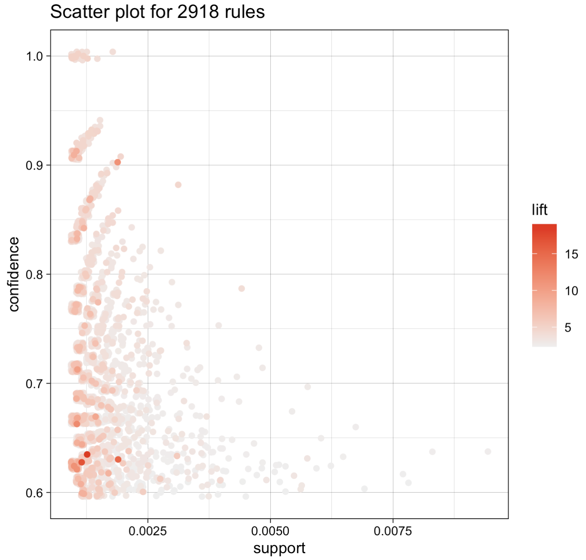
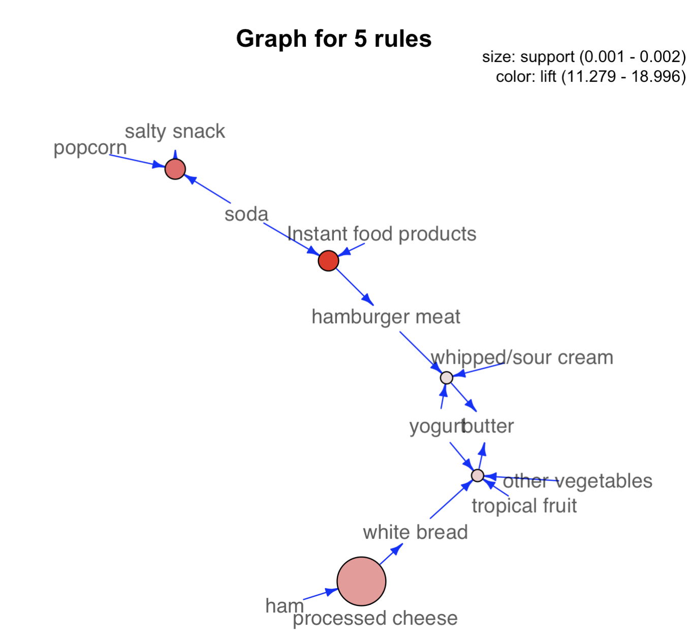

# TOPIC 9 - Association Rules

### Definition

Association rules is a descriptive, not predictive, method often used to discover interesting relationships hidden in a large data set.

The disclosed relationships can be represented as rules or frequent itemsets.

For example, given a large collection of retail transactions, in which each transaction consists of one or more items, association rules go through the items being purchased to see what items are frequently bought together and to discover a list of rules that describe the purchasing behavior.

An **itemset** refers to a collection of items or individual entities that contain some kind of relationship.
An itemset containing k items is called a **k-itemset** and the notation $\{ \text{item 1}, \text{item 2}, \ldots, \text{item k} \}$ is used to denote a k-itemset.

### Apriori Algorithm

Given an itemset $L$, the **support** of $L$ is the percentage of transactions that contain $L$.

A _frequent_ itemset has items that appear together _often enough_.
The term "often enough" is formally defined with a **minimum support criterion**.

If the minimum support is set at 0.5, any itemset can be considered a _frequent_ itemset if at least 50% of the transactions contain this itemset.

The Apriori Algorithm takes a **bottom-up iterative approach** to uncovering the frequent itemsets by:

1. Determine all the possible items (or 1-itemsets, for example $\{ \text{bread} \}$, $\{ \text{egg} \}$, $\{ \text{milk} \}$)
2. Identify which among the items are frequent based on a minimum support threshold (or the minimum support criterion).
3. The identified frequent 1-itemsets are paired into 2-itemsets and checked whether the 2-itemsets meet the support criterion
4. Step 3 is repeated, with the algorithm checking whether the support criterion can be met at each iteration, and growing the itemset if possible.
5. The algorithm ends when **no itemsets meet the minimum support threshold** or until the **itemsets reach a predefined length**.

When completed, output of the Apriori algorithm is the **collection of all the frequent k-itemsets**.

A collection of **candidate rules** is formed based on the frequent k-itemsets uncovered, for instance, a frequent itemset $\{ \text{milk, eggs} \}$ may suggest candidate rules $\{ \text{milk} \}$ → $\{ \text{eggs} \}$ and $\{ \text{eggs} \}$ → $\{ \text{milk} \}$.

### Evaluation of Candidate Rules

#### Confidence

The confidence for candidate rule $X \to Y$ is the percent of transactions that contain both $X$ and $Y$ out of all the transactions that contain $X$:

$$
\text{Confidence}(X \to Y) = \frac{\text{Support}(X \land Y)}{\text{Support}(X)}
$$

Since $(\text{Support}(X \land Y) \leq \text{Support}(X))$ always, we have $(\text{Confidence}(X \to Y) \leq 1)$.

A relationship may be thought of as **interesting** when the algorithm identifies the relationship with a measure of confidence greater than or equal to a predefined threshold.
This predefined threshold is called the **minimum confidence**.

---

#### Lift

Lift measures how many times **more often** $X$ and $Y$ occur together than expected if they are statistically independent of each other. (How $X$ and $Y$ are **really related** rather than **coincidentally happening** together.)

$$
\text{Lift}(X \to Y) = \frac{\text{Support}(X \land Y)}{\text{Support}(X) \times \text{Support}(Y)}.
$$

Lift is **$1$** if $X$ and $Y$ are s**tatistically independent** of each other.

In contrast, a lift of $X \to Y$ **greater than 1** indicates that there is **some usefulness** to the rule.

---

#### Leverage

Leverage measures the difference in the probability of $X$ and $Y$ appearing together in the data set compared to what would be expected if $X$ and $Y$ were statistically independent of each other.

$$
\text{Leverage}(X \to Y) = \text{Support}(X \land Y) - \text{Support}(X) \times \text{Support}(Y)
$$

In theory, leverage is **$0$** when $X$ and $Y$ are **statistically independent** of each other.

A **larger leverage absolute value** indicates a **stronger relationship** between $X$ and $Y$.

### Initialisation

Install and run the needed packages:

```r
install.packages('arules')
install.packages('arulesViz')
```

```r
library('arules')
library('arulesViz')
```

### Analysing the Dataset

The example uses the Groceries data set from the package `arules' in R. The Groceries dataset is collected from 30 days of real-world point-of-sale transactions of a grocery store. The dataset contains 9835 transactions, and the items are aggregated into 169 categories.

```r
data(Groceries)
Groceries
```

```
transactions in sparse format with
 9835 transactions (rows) and
 169 items (columns)
```

</br>

```r
summary(Groceries)
```

```
most frequent items:
      whole milk other vegetables       rolls/buns             soda
            2513             1903             1809             1715
          yogurt          (Other)
            1372            34055

element (itemset/transaction) length distribution:
sizes
   1    2    3    4    5    6    7    8    9   10   11   12   13   14   15   16
2159 1643 1299 1005  855  645  545  438  350  246  182  117   78   77   55   46
  17   18   19   20   21   22   23   24   26   27   28   29   32
  29   14   14    9   11    4    6    1    1    1    1    3    1

   Min. 1st Qu.  Median    Mean 3rd Qu.    Max.
  1.000   2.000   3.000   4.409   6.000  32.000

includes extended item information - examples:
       labels  level2           level1
1 frankfurter sausage meat and sausage
2     sausage sausage meat and sausage
3  liver loaf sausage meat and sausage
```

</br>

```r
inspect(head(Groceries)) # the first 6 transactions
```

```
    items
[1] {citrus fruit,
     semi-finished bread,
     margarine,
     ready soups}
[2] {tropical fruit,
     yogurt,
     coffee}
[3] {whole milk}
[4] {pip fruit,
     yogurt,
     cream cheese ,
     meat spreads}
[5] {other vegetables,
     whole milk,
     condensed milk,
     long life bakery product}
[6] {whole milk,
     butter,
     yogurt,
     rice,
     abrasive cleaner}
```

`head` can take in an optional 2nd argument to specify the number of transactions. For example, `inspect(head(Groceries, 10))` to get the first 10 transactions

---

Data set 'Groceries' is a transaction class, as defined by the `arules` package. A transactions class has three component slots:

1. `itemsetInfo`: A data frame with vectors of the same length as the number of transactions.
2. `itemInfo`: A data frame to store item labels.
3. `data`: A binary incidence matrix that indicates which item labels appear in every transaction.

<br>

```r
Groceries@itemInfo[1:10,]
```

```
              labels  level2           level1
1        frankfurter sausage meat and sausage
2            sausage sausage meat and sausage
3         liver loaf sausage meat and sausage
4                ham sausage meat and sausage
5               meat sausage meat and sausage
6  finished products sausage meat and sausage
7    organic sausage sausage meat and sausage
8            chicken poultry meat and sausage
9             turkey poultry meat and sausage
10              pork    pork meat and sausage
```

- labels: Names of the grocery items.
- level2: Specific subcategories (e.g., “sausage”).
- level1: Higher-level categories (e.g., “meat and sausage”).

<br>

```r
Groceries@data[,100:110] # 11 columns and 169 rows.
#169 rows for 169 categories of items and 11 columns for 11 transactions
```

```
 [1,] . . . | . . . . . . .
 [2,] . . | . | . . . . . .
 [3,] . . . . . . . . . . .
 [4,] . . . . . . . . . . .
 [5,] . . . . . . . . . . .

[165,] . . . . . . . . . . .
[166,] . . . . . . . . . . .
[167,] . . . . . . . . . . .
[168,] . . . . | . . . . . .
[169,] . . . . . . . . . . .
```

Rows:

- Each row corresponds to an item category (169 total rows for 169 unique items in the dataset).
- Examples of categories might include “frankfurter,” “chicken,” etc.

Columns:

- Each column represents a transaction (11 columns shown in this output for 11 transactions, starting from transaction #100).

Cells:

- A dot `.` represents a 0, meaning the item is not included in that transaction.
- A `|` or other marker indicates a 1, meaning the item was purchased in that transaction.

### Itemsets

**Getting the frequent 1-itemsets:**

```r
itemsets.1 <- apriori(Groceries, parameter=list(minlen=1,
                                                maxlen=1,
                                                support=0.02,
                                                target="frequent itemsets"))
```

Note:

- `minlen = 1`: frequent itemset has at least 1 item
- `maxlen = 1`: frequent itemset has at max 1 item
- Setting both `minlen = 1` and `maxlen = 1` means we want frequent itemset that has strictly 1 item.

```r
summary(itemsets.1)
```

```
set of 59 itemsets

most frequent items:
frankfurter     sausage         ham        meat     chicken     (Other)
          1           1           1           1           1          54

element (itemset/transaction) length distribution:sizes
 1
59

   Min. 1st Qu.  Median    Mean 3rd Qu.    Max.
      1       1       1       1       1       1

summary of quality measures:
    support            count
 Min.   :0.02105   Min.   : 207.0
 1st Qu.:0.03015   1st Qu.: 296.5
 Median :0.04809   Median : 473.0
 Mean   :0.06200   Mean   : 609.8
 3rd Qu.:0.07666   3rd Qu.: 754.0
 Max.   :0.25552   Max.   :2513.0

includes transaction ID lists: FALSE

mining info:
      data ntransactions support confidence
 Groceries          9835    0.02          1
                                                                                                              call
 apriori(data = Groceries, parameter = list(minlen = 1, maxlen = 1, support = 0.02, target = "frequent itemsets"))
```

List the most 10 frequent 1-itemsets:

```r
inspect(head(sort(itemsets.1, by = "support"), 10))
```

```
     items              support    count
[1]  {whole milk}       0.25551601 2513
[2]  {other vegetables} 0.19349263 1903
[3]  {rolls/buns}       0.18393493 1809
[4]  {soda}             0.17437722 1715
[5]  {yogurt}           0.13950178 1372
[6]  {bottled water}    0.11052364 1087
[7]  {root vegetables}  0.10899847 1072
[8]  {tropical fruit}   0.10493137 1032
[9]  {shopping bags}    0.09852567  969
[10] {sausage}          0.09395018  924
```

List all the 59 frequent 1-itemsets:

```r
inspect(sort(itemsets.1, by ="support"))
```

---

**Getting the frequent 2-itemsets: **

```r
itemsets.1 <- apriori(Groceries, parameter=list(minlen=2,
                                                maxlen=2,
                                                support=0.02,
                                                target="frequent itemsets"))
```

```r
summary(itemsets.2)
```

List all the frequent 2-itemsets:

```r
inspect(sort(itemsets.2, by ="support"))
```

List of most 10 frequent 2-itemsets:

```r
inspect(head(sort(itemsets.2, by = "support"), 10))
```

---

**Getting the frequent 3-itemsets:**

```r
itemsets.3 <- apriori(Groceries, parameter=list(minlen=3,
                                                maxlen=3,
                                                support=0.02,
                                                target="frequent itemsets"))
```

```r
summary(itemsets.3)
```

```
set of 2 itemsets ...
```

List of two frequent 3-itemsets:

```r
inspect(sort(itemsets.3, by ="support"))
```

```
    items                                           support    count
[1] {root vegetables, other vegetables, whole milk} 0.02318251 228
[2] {other vegetables, whole milk, yogurt}          0.02226741 219
```

### Getting the Rules

```r
rules <- apriori(Groceries, parameter=list(support=0.001,
                                           confidence=0.6,
                                           target = "rules"))
```

```
Apriori

Parameter specification:
 confidence minval smax arem  aval originalSupport maxtime support minlen maxlen
        0.6    0.1    1 none FALSE            TRUE       5   0.001      1     10
 target  ext
  rules TRUE

Algorithmic control:
 filter tree heap memopt load sort verbose
    0.1 TRUE TRUE  FALSE TRUE    2    TRUE

Absolute minimum support count: 9

set item appearances ...[0 item(s)] done [0.00s].
set transactions ...[169 item(s), 9835 transaction(s)] done [0.00s].
sorting and recoding items ... [157 item(s)] done [0.00s].
creating transaction tree ... done [0.00s].
checking subsets of size 1 2 3 4 5 6 done [0.01s].
writing ... [2918 rule(s)] done [0.00s].
creating S4 object  ... done [0.00s].
```

Plot scatter plot of all 2918 rules:

```r
plot(rules)
```

<div align="center">
  
</div>

The darker points have greater lift, and are the more significant rules.
<br>
Getting the top 3 rules sorted by lift:

```r
inspect(head(sort(rules, by="lift"), 3))
```

```
    lhs                              rhs              support     confidence
[1] {Instant food products, soda} => {hamburger meat} 0.001220132 0.6315789
[2] {soda, popcorn}               => {salty snack}    0.001220132 0.6315789
[3] {ham, processed cheese}       => {white bread}    0.001931876 0.6333333
    coverage    lift     count
[1] 0.001931876 18.99565 12
[2] 0.001931876 16.69779 12
[3] 0.003050330 15.04549 19
```

<br>

Plot the top 5 rules sorted by lift:

```r
highLiftRules <- head(sort(rules, by="lift"), 5)
plot(highLiftRules, method = "graph", engine = "igraph", edgeCol = "blue", alpha = 1)
```

<div align="center">
  
</div>

The bigger the circle, the greater the support.
The darker the circle, the greater the lift.
